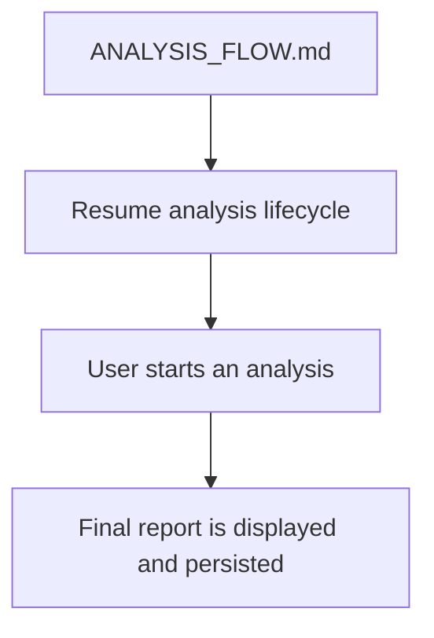
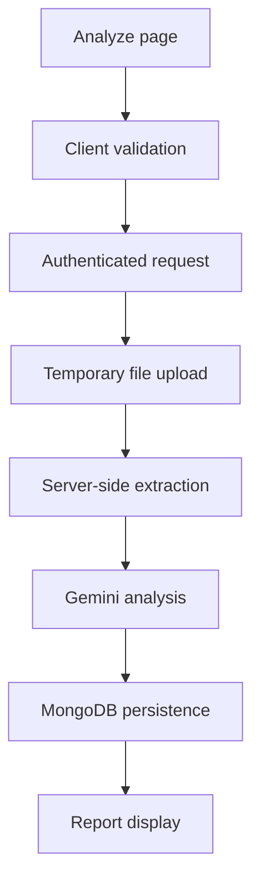
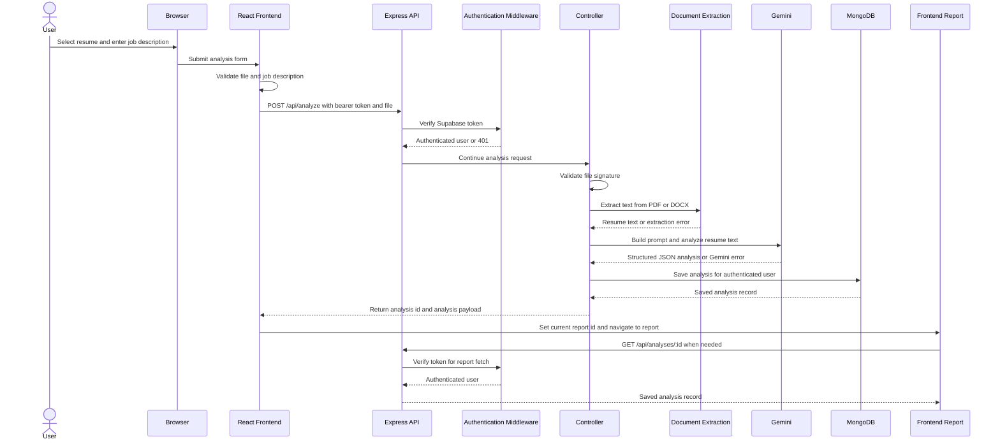
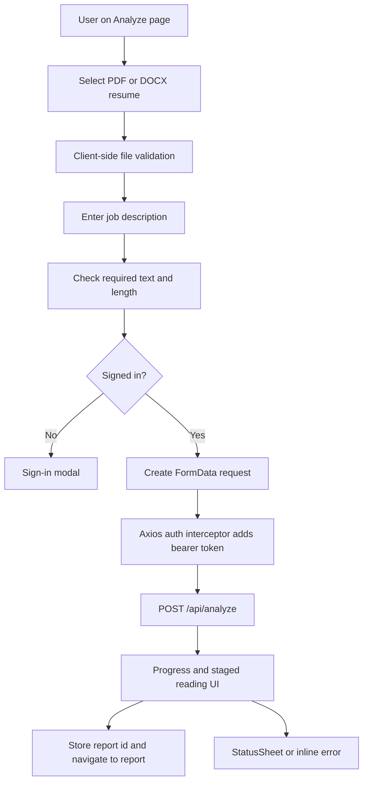
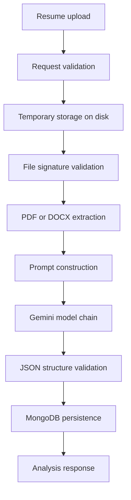
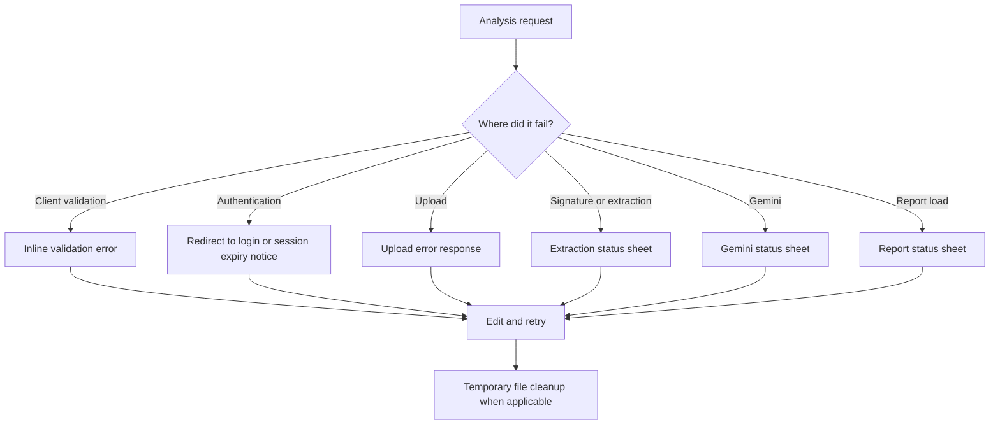
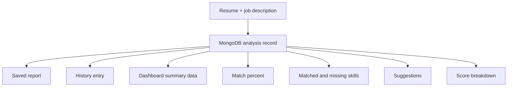
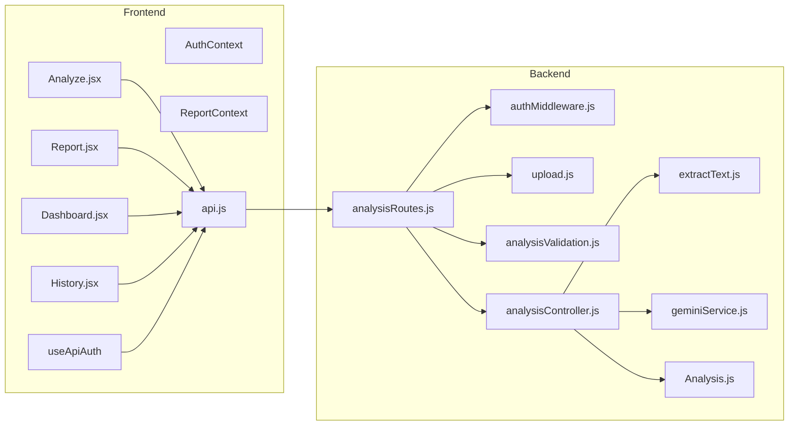
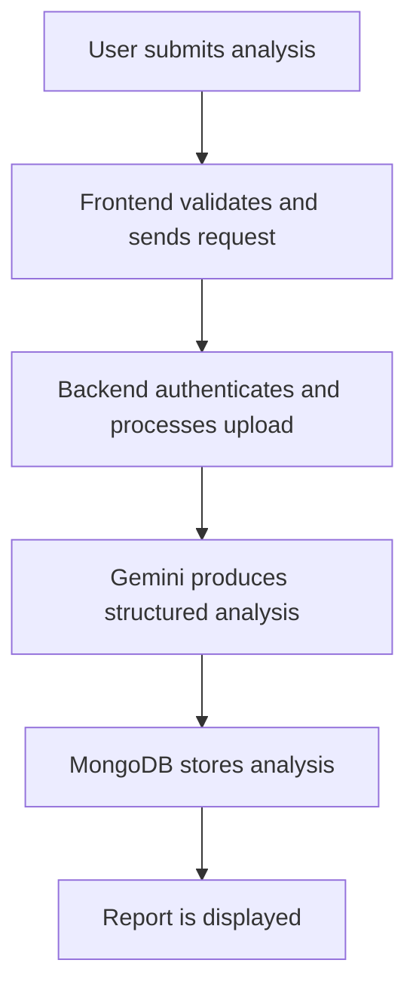

# Analysis Flow

## 1. Purpose



This document describes the implemented lifecycle of a resume analysis from submission through extraction, Gemini processing, persistence, and report display. It focuses on one workflow only.

## 2. Analysis Lifecycle Overview



The analysis lifecycle starts on the Analyze page, moves through authenticated API processing, and ends when the saved report is rendered in the UI. The backend keeps the uploaded file temporary and deletes it after processing.

## 3. End-to-End Analysis Sequence



The browser submits the analysis request only after the frontend validation passes. The API authenticates the request, the controller runs extraction and Gemini analysis, MongoDB stores the result, and the frontend report displays the saved analysis.

## 4. Frontend Flow



The frontend validates the selected file and job description before sending the request. If the user is not signed in, the Analyze page opens the sign-in modal instead of submitting. After a successful response, the page stores the report id and navigates to the report view.

## 5. Backend Flow

```mermaid
flowchart TD
  Request[POST /api/analyze] --> AuthMW[authMiddleware]
  AuthMW --> Upload[upload.single('file')]
  Upload --> RequestCheck[analysisValidation]
  RequestCheck --> Signature[validateFileSignature]
  Signature --> Extract[extractResumeText]
  Extract --> Gemini[analyzeWithGemini]
  Gemini --> Parse[JSON validation]
  Parse --> Save[Analysis.create]
  Save --> Cleanup[cleanupUploadedFile]
  Cleanup --> Response[Return analysis id and analysis]
```

The backend requires a valid Supabase bearer token before it accepts the upload. It validates the request body, checks the uploaded file signature, extracts text, runs Gemini analysis, stores the result in MongoDB, and cleans up the temporary file in both success and failure paths.

## 6. Analysis Pipeline



The implemented pipeline processes one uploaded resume at a time. PDF extraction uses `pdf-parse`; DOCX extraction uses `mammoth`. Gemini returns structured JSON, which the controller parses before persisting the analysis record.

## 7. Error & Recovery Flow



Implemented recovery behavior includes client-side validation messages, guest sign-in prompting, API status sheets, retry actions, session-expiry handling, and guaranteed cleanup of temporary uploads. Gemini failures are classified and mapped to user-facing error states. Retryable provider failures trigger the configured model fallback path before the request fails.

## 8. Data Produced



The analysis lifecycle produces a persisted analysis record and UI-visible outputs derived from that record. The stored analysis includes the match percent, matched skills, missing skills, suggestions, score breakdown, the original job description, the extracted resume text, the user identity, and the uploaded filename.

## 9. Related Components



The analysis lifecycle involves the Analyze, Report, Dashboard, and History pages on the frontend, the shared Axios client and auth hook, and the backend route, middleware, controller, extraction, Gemini, and model modules.

## 10. Summary



The implemented analysis workflow validates input in the browser, authenticates the request on the API, extracts resume text on the server, runs Gemini analysis, stores the result in MongoDB, and returns the saved analysis for report display.
