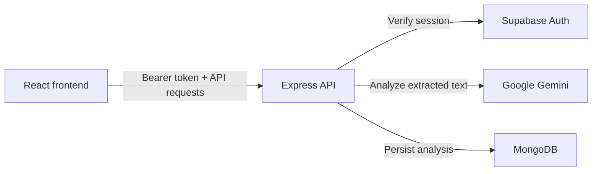
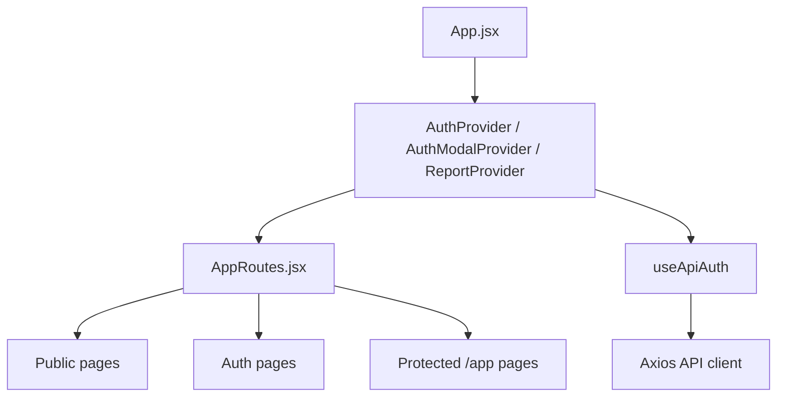
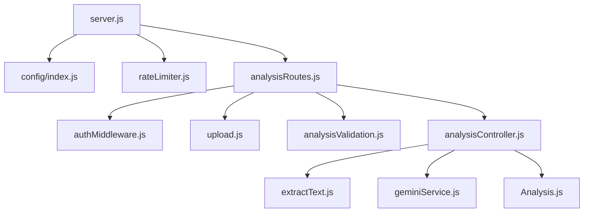
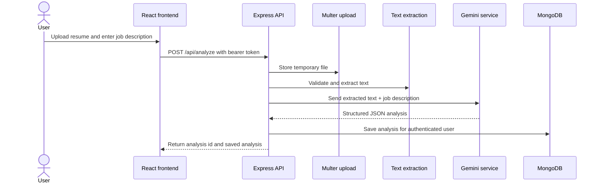
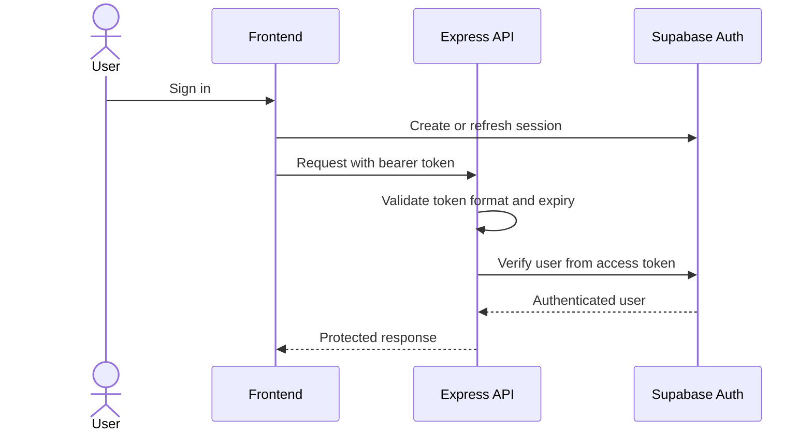

# Architecture

## 1. Purpose

This document describes how Resume Analyzer is built at the system level. It focuses on the implemented frontend, backend, authentication, analysis pipeline, and integration boundaries.

## 2. Architectural Principles

- Separate the frontend and backend into distinct runtimes.
- Treat Supabase access tokens as the authentication boundary for protected API calls.
- Keep uploaded resumes temporary and remove them after processing.
- Validate inputs before analysis or persistence.
- Keep AI output structured and parseable before storing it.
- Favor per-user data isolation in server-side reads and writes.
- Use shared UI and shared service abstractions where the same behavior appears in multiple routes or pages.

## 3. High-Level Architecture

The system is a React single-page application served separately from an Express API.

- The browser renders public pages, authentication pages, and authenticated application pages.
- The frontend uses Supabase Auth for session management and sends the access token to the API through an Axios interceptor.
- The API verifies the token, accepts temporary resume uploads, extracts text from the uploaded document, sends the extracted text and job description to Gemini, and stores the resulting analysis in MongoDB.
- Saved analyses are later fetched from the API and rendered in the dashboard, report, and history views.

## 4. Major System Components

- React frontend application
- React Router route layer
- Supabase authentication client and session context
- Axios API client with auth interception
- Express API server
- Authentication middleware
- Upload middleware and cleanup utilities
- Text extraction service
- Gemini analysis service
- MongoDB analysis model
- Error handling and rate limiting middleware

## 5. Frontend Architecture

The frontend is organized around route-driven page composition and shared UI state.

- `App.jsx` composes the auth provider, auth modal provider, report provider, API auth bridge, error boundary, scroll restoration, and route tree.
- `AppRoutes.jsx` separates public pages, public preview app routes, public authentication routes, and protected `/app/*` routes.
- `AuthContext` owns the Supabase session and user state.
- `AuthModalContext` manages login and signup navigation, plus deferred actions after re-authentication.
- `ReportContext` stores the active report identifier so report navigation can reopen a saved analysis.
- `useApiAuth` connects the current Supabase session to the Axios client, adds bearer tokens, and handles 401 responses and session expiry behavior.
- Pages are implemented as route-level views, while reusable UI lives in shared components such as layouts, status states, charts, and paper primitives.
- The frontend keeps some transient workflow state in browser storage, including the latest job description draft and the latest analysis result for resume/review continuity.

## 6. Backend Architecture

The backend is a single Express application with configuration validation, middleware, a controller layer, and service modules.

- `server.js` loads environment variables, validates them, configures middleware, mounts routes, exposes a health endpoint, connects to MongoDB, and starts the HTTP server.
- `config/index.js` derives server, database, and CORS configuration from environment variables.
- `analysisRoutes.js` defines the protected analysis, list, report, and delete routes.
- `authMiddleware.js` verifies Supabase bearer tokens and attaches the authenticated user to the request.
- `upload.js` configures Multer storage, file filtering, file size limits, and file signature validation.
- `analysisValidation.js` verifies that a file and job description are present and applies request-level constraints.
- `rateLimiter.js` applies route-specific limits with development bypass behavior.
- `analysisController.js` coordinates file validation, extraction, Gemini analysis, persistence, and cleanup.
- `extractText.js` handles PDF and DOCX text extraction and validation.
- `geminiService.js` builds the prompt, calls Gemini, validates the response, retries retryable failures, and normalizes provider errors.
- `Analysis.js` defines the MongoDB model used for persisted analyses.

## 7. Data Flow

### Analysis Pipeline

1. A user signs in through Supabase on the frontend.
2. The frontend stores the Supabase session and attaches the access token to API requests.
3. The user submits a resume file and job description from the analyze page.
4. The API validates the request, stores the file temporarily, and confirms the file signature.
5. The backend extracts text from the uploaded PDF or DOCX file.
6. The backend sends the extracted text and job description to Gemini.
7. The backend parses the structured JSON response and stores the analysis in MongoDB with the authenticated user's identity.
8. The frontend uses the returned analysis identifier and saved result data to render the report and later load the archive or dashboard views.

## 8. External Service Integration

- Supabase
  - The frontend uses `@supabase/supabase-js` for sign in, sign up, password reset, session inspection, and sign out.
  - The backend uses the Supabase service role client to verify access tokens and resolve the authenticated user.
- Google Gemini
  - The backend uses `@google/generative-ai` to generate structured resume analysis.
  - The service tries a model chain and falls back to the next model when retryable provider errors occur.
- MongoDB
  - The backend uses Mongoose to persist saved analysis records and query them by authenticated user.

## 9. Security Architecture

### Authentication Flow

- Protected API routes require Supabase bearer tokens.
- The backend checks token expiration before calling Supabase user lookup.
- CORS uses an allowlist derived from configuration.
- Helmet is enabled on the API server.
- Route-specific rate limiting is applied to authentication, analysis, dashboard, history, report, and general API traffic.
- Uploaded files are restricted to PDF and DOCX by MIME type, extension, and file signature.
- Upload size is limited to 5 MB.
- Job description input is validated and length-limited before analysis.
- Temporary upload files are deleted after success and failure paths.
- Environment variables are validated at startup so missing secrets fail fast.
- Error handling returns development stack traces only when `NODE_ENV` is not production.
- Analysis queries and deletes are scoped to the authenticated user's `userId`.

## 10. Design Decisions

- Keep the frontend and backend separately deployable and independently scoped.
- Persist only analysis output and extracted text, not uploaded resume files.
- Use server-side extraction so the AI receives only the content needed for analysis.
- Keep the analysis response shape structured so the frontend can render it consistently.
- Use shared page state and local storage for short-lived workflow continuity rather than introducing another backend store.
- Use a fallback Gemini model chain to reduce analysis failures from provider availability issues.
- Keep status and error presentation centralized so pages share the same recovery behavior.

## 11. Scalability Considerations

- Per-user filtering keeps analysis reads and deletes bounded to a single account.
- Pagination is implemented in the backend for analysis listings.
- Route-specific throttling reduces repeated requests against the analysis and archive endpoints.
- Temporary upload handling keeps disk usage bounded to the processing window.
- Server-side extraction and analysis keep the browser thin and avoid client-side document processing costs.
- The API health endpoint provides a simple readiness signal for runtime checks.

## 12. Current Architecture Summary

Resume Analyzer is a two-tier application built from a React frontend and an Express API. The frontend manages Supabase sessions, route composition, and analysis presentation. The backend verifies identity, processes uploaded documents, calls Gemini, stores analyses in MongoDB, and enforces the security and validation boundaries around the analysis workflow.
