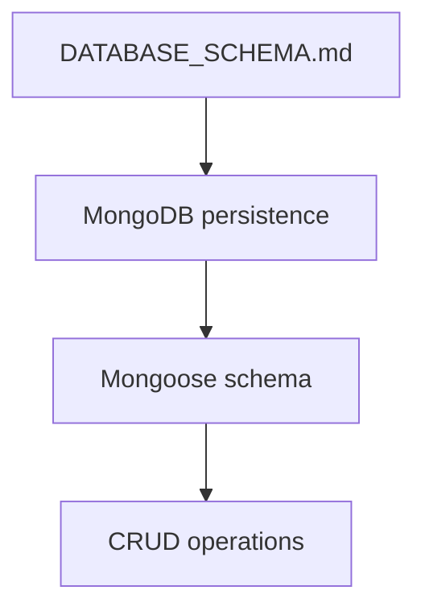
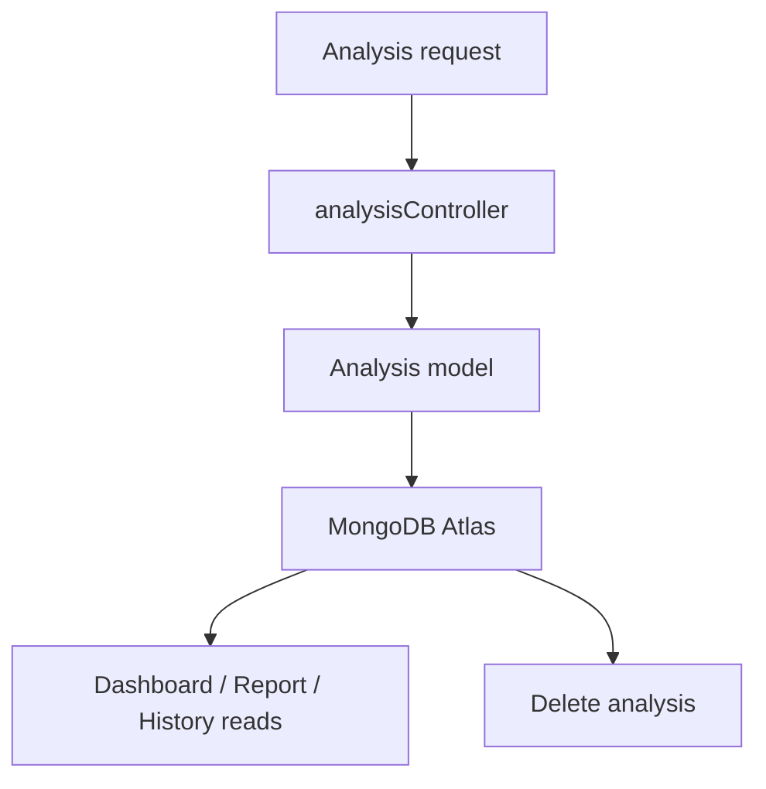
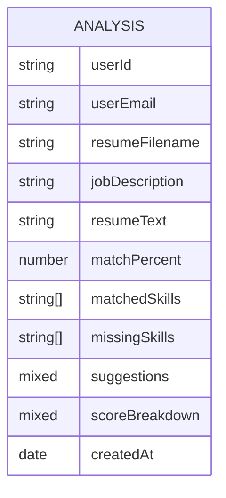
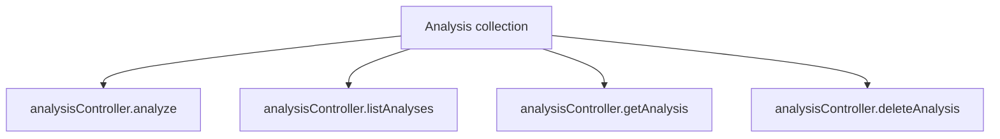
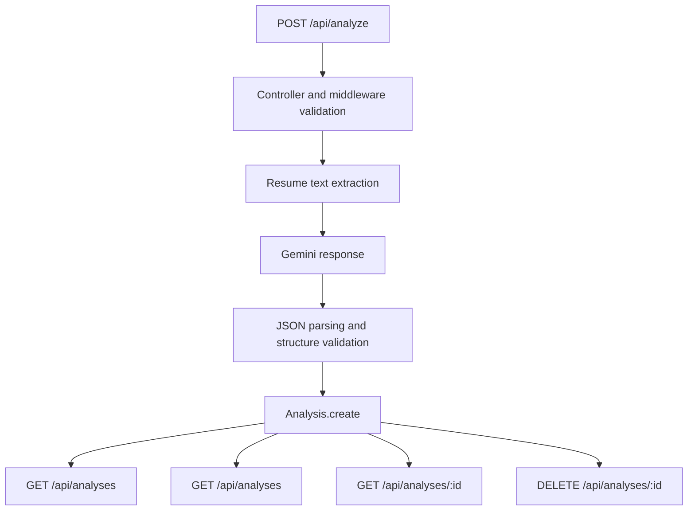
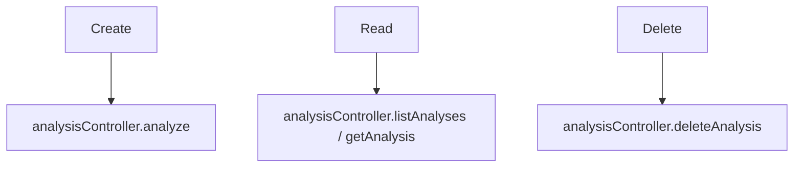
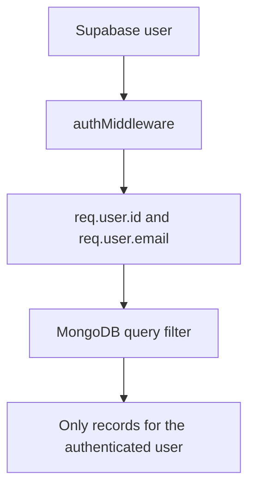
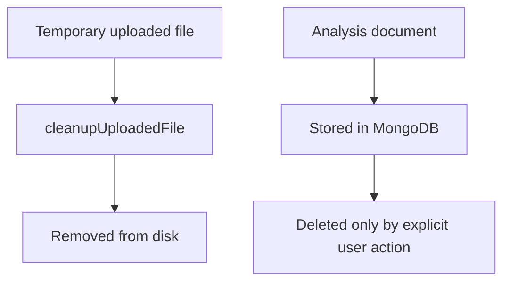
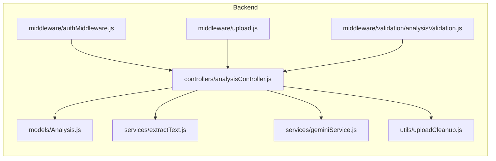
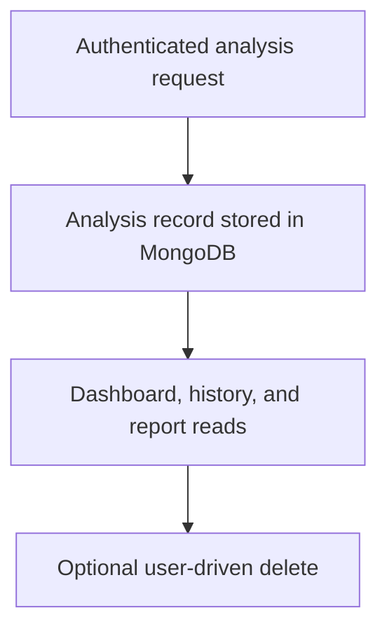

# Database Schema

## 1. Purpose

This document describes how Resume Analyzer persists analysis data in MongoDB and how the implemented schema is used by the backend.

## 2. Database Overview

Resume Analyzer uses MongoDB Atlas as the persistence layer and Mongoose as the ODM. The backend persists analysis results as completed records after Gemini returns structured output, and later reads or deletes those records by authenticated user.

## 3. Entity Relationship Diagram

Only one MongoDB collection is implemented: `Analysis`. No inter-collection relationships are defined in the repository.

## 4. Collections

### Analysis

**Purpose:** Store one completed resume analysis per analysis request.

**Stored Data:** `userId`, `userEmail`, `resumeFilename`, `jobDescription`, `resumeText`, `matchPercent`, `matchedSkills`, `missingSkills`, `suggestions`, `scoreBreakdown`, `createdAt`

**Relationships:** No MongoDB relationships to other collections are implemented. Ownership is represented through the `userId` and `userEmail` fields.

**Indexes:** 

- Compound index on `{ userId: 1, createdAt: -1 }`
- Single-field index on `{ createdAt: -1 }`

**Lifecycle:** Created after a successful analysis request, read by dashboard/report/history requests, and deleted by the history delete action.

## 5. Data Lifecycle

The analysis record is created only after the backend successfully validates the upload, extracts text, and parses a Gemini response. The stored record is then read by dashboard, history, and report requests, or deleted by the history delete flow.

## 6. CRUD Operations

- **Create:** Implemented in `analysisController.analyze` via `Analysis.create(...)`.
- **Read:** Implemented in `analysisController.listAnalyses` via `Analysis.countDocuments(...)` and `Analysis.find(...)`, and in `analysisController.getAnalysis` via `Analysis.findOne(...)`.
- **Update:** No database update operation is implemented.
- **Delete:** Implemented in `analysisController.deleteAnalysis` via `Analysis.findOneAndDelete(...)`.

## 7. Data Ownership

All persisted analysis records are owned by the authenticated Supabase user that created them. The controller writes `req.user.id` and `req.user.email` into each record, and all read and delete queries filter on `userId` from the authenticated request.

## 8. Data Retention

Uploaded resume files are temporary and are removed after the analysis request finishes, including failure paths handled by the controller and upload validation layer. The analysis record itself is persistent in MongoDB until the authenticated user deletes it.

## 9. Related Components

The database layer is primarily coordinated by the analysis controller and the `Analysis` model, with authentication, upload handling, extraction, Gemini analysis, and cleanup modules feeding the persistence flow.

## 10. Summary

Resume Analyzer persists one implemented MongoDB collection, `Analysis`, using Mongoose. The backend creates a record after a successful analysis, reads it for dashboard/report/history views, and deletes it only when the authenticated user explicitly removes it.
