# Feature Mapping

## 1. Purpose

This document maps each implemented user-facing feature to the code paths that support it. It traces how a feature starts in the frontend, which API calls it makes, which backend modules run, what services are involved, whether MongoDB is used, and how the response returns to the UI.

## 2. Feature Inventory

- Public Website: Landing page, Features page, FAQ page, Not Found page, public preview routes
- Authentication: Login, Signup, Password reset request, Password reset completion, Logout, protected session handling
- Resume Analysis: Resume submission, client-side validation, server-side extraction, Gemini analysis, report handoff
- Dashboard: Archive summary, continue working panel, recent analyses, quick actions
- History: Archive listing, search, pagination, delete analysis
- Reports: Saved report view, score summary, suggestions, job description highlighting, copy suggestions
- Account: Profile details, session details, password reset from account, sign out
- Status and Recovery: Full-page status states, inline validation states, render error fallback

## 3. Feature Mapping

### Landing Page

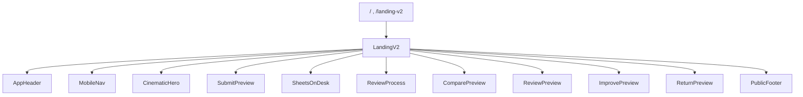

**Purpose:** Introduce the product and route visitors into review, feature, and FAQ pages.

**Frontend Entry Point:** `client/src/pages/LandingV2.jsx`

**API Endpoint(s):** None

**Backend Components:** None

**Services Used:** None

**Database Interaction:** None

**Response:** Renders the public landing experience with navigation, feature previews, and calls to action into the review flow.

**Dependencies:** `AppHeader`, `MobileNav`, `CinematicHero`, the landing preview components, and `PublicFooter`.

**Failure Handling:** No API dependency. Unexpected render failures are handled by the app-level `ErrorBoundary`.

**Implementation Notes:** The same component serves both `/` and `/landing-v2`.

### Features Page

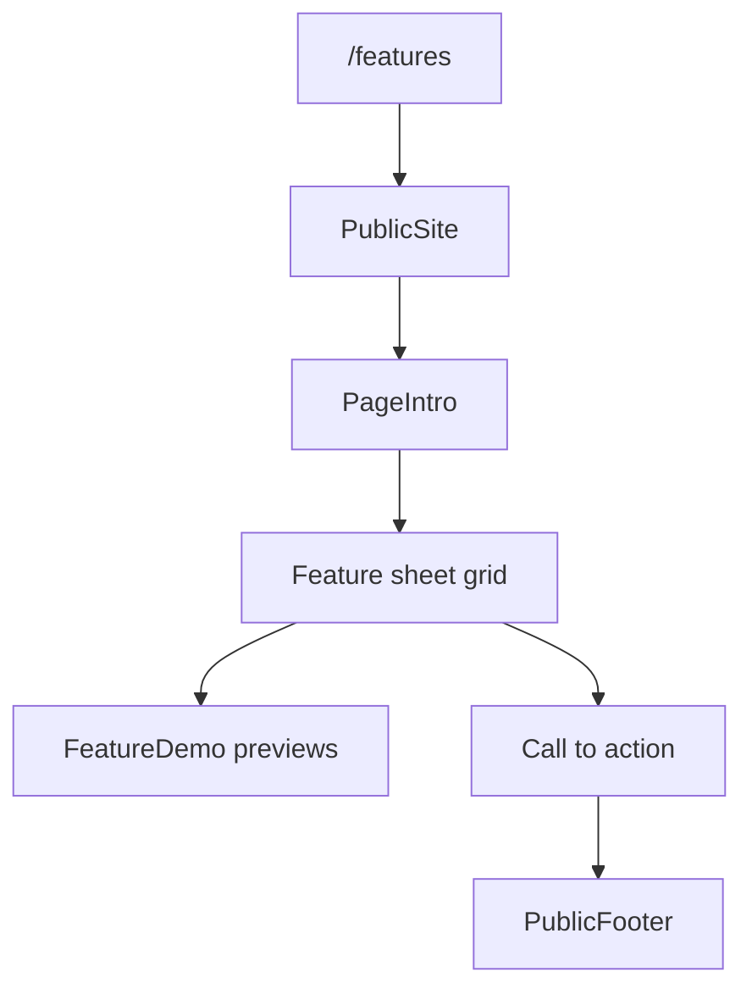

**Purpose:** Present the implemented product capabilities in a structured public page.

**Frontend Entry Point:** `client/src/pages/Features.jsx`

**API Endpoint(s):** None

**Backend Components:** None

**Services Used:** None

**Database Interaction:** None

**Response:** Renders a feature grid with demo states and a call to action into the analysis flow.

**Dependencies:** `PublicSite`, `PageIntro`, `Sheet`, `PaperClip`, `StickyNote`, and the local feature demo components.

**Failure Handling:** No API dependency. Render errors fall back to the app-level `ErrorBoundary`.

**Implementation Notes:** The feature cards are static page content driven by local component state for hover demos.

### FAQ Page

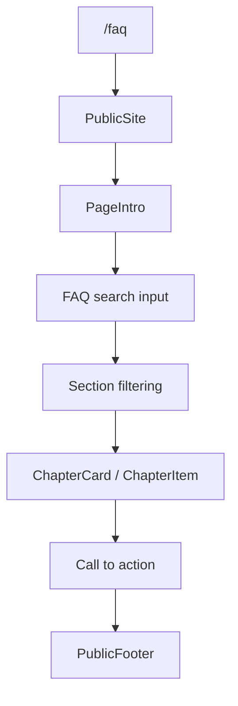

**Purpose:** Provide implemented answers about analysis, files, privacy, and usage.

**Frontend Entry Point:** `client/src/pages/FAQ.jsx`

**API Endpoint(s):** None

**Backend Components:** None

**Services Used:** None

**Database Interaction:** None

**Response:** Renders searchable FAQ chapters with expandable answers and links back into the review flow.

**Dependencies:** `PublicSite`, `Sheet`, `StickyNote`, `PaperClip`, the accordion components, and the built-in search/filter logic.

**Failure Handling:** No API dependency. The page remains usable even when the search query returns no matching chapters.

**Implementation Notes:** The FAQ content is local to the page and filtering happens entirely in the browser.

### Public Preview Routes

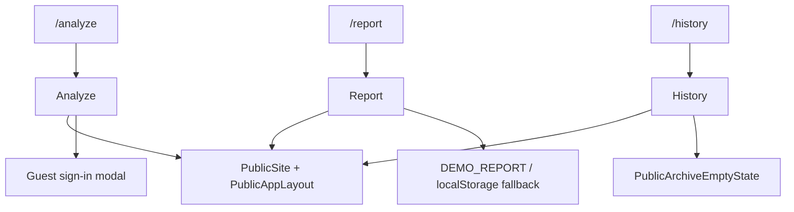

**Purpose:** Expose preview versions of the review, report, and archive screens without requiring sign-in.

**Frontend Entry Point:** `client/src/routes/AppRoutes.jsx`, `client/src/pages/app/Analyze.jsx`, `client/src/pages/app/Report.jsx`, `client/src/pages/app/History.jsx`

**API Endpoint(s):** None when unauthenticated

**Backend Components:** None when unauthenticated

**Services Used:** `AuthContext` for session state, browser storage for the report fallback path

**Database Interaction:** None when unauthenticated

**Response:** Renders preview or empty states instead of the authenticated app experience.

**Dependencies:** `PublicSite`, `PublicAppLayout`, and the same page components used by the authenticated app routes.

**Failure Handling:** The preview pages do not require backend access; they fall back to demo or empty states when no user session is present.

**Implementation Notes:** The same page components are shared between public preview routes and protected app routes.

### Not Found Page

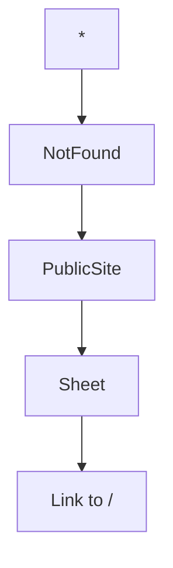

**Purpose:** Provide a fallback page for unmatched routes.

**Frontend Entry Point:** `client/src/pages/NotFound.jsx`

**API Endpoint(s):** None

**Backend Components:** None

**Services Used:** None

**Database Interaction:** None

**Response:** Renders a 404 page with a link back to the home page.

**Dependencies:** `PublicSite`, `Sheet`, `Eyebrow`, and `Link`.

**Failure Handling:** This is the failure fallback for missing routes.

**Implementation Notes:** The page is intentionally minimal and uses the shared public shell.

### Login

```mermaid
flowchart TD
  Route["/login"] --> Login[Login]
  Login --> Layout[AuthLayout]
  Login --> Notice[consumeAuthNotice / location.state]
  Login --> Submit[signIn(email, password)]
  Submit --> Supabase[Supabase auth.signInWithPassword]
  Supabase --> Pending[executePendingAction]
  Pending --> Redirect[navigate(from)]
```

**Purpose:** Authenticate an existing user and return them to the intended destination.

**Frontend Entry Point:** `client/src/pages/auth/Login.jsx`

**API Endpoint(s):** None

**Backend Components:** None

**Services Used:** `AuthContext`, `AuthModalContext`, `supabase.auth.signInWithPassword`

**Database Interaction:** None

**Response:** Signs the user in, replays any pending action, and navigates to the original route or dashboard.

**Dependencies:** `AuthLayout`, `AuthField`, `AuthInput`, `AuthMessage`, `AuthPrimaryButton`, and `AuthSecondaryLink`.

**Failure Handling:** Displays inline sign-in errors and login notices from session storage or route state.

**Implementation Notes:** The page supports redirecting back to the route that triggered the login flow.

### Signup

```mermaid
flowchart TD
  Route["/signup"] --> Signup[Signup]
  Signup --> Layout[AuthLayout]
  Signup --> Validate[Local password checks]
  Validate --> Submit[signUp(email, password, metadata)]
  Submit --> Supabase[Supabase auth.signUp]
  Supabase --> Redirect[navigate(from) or confirmation notice]
```

**Purpose:** Create a new Supabase-backed user account.

**Frontend Entry Point:** `client/src/pages/auth/Signup.jsx`

**API Endpoint(s):** None

**Backend Components:** None

**Services Used:** `AuthContext`, `supabase.auth.signUp`

**Database Interaction:** None

**Response:** Creates the account, then either navigates into the app or shows the email confirmation notice returned by Supabase.

**Dependencies:** `AuthLayout`, `AuthField`, `AuthInput`, `AuthMessage`, and `AuthPrimaryButton`.

**Failure Handling:** Validates password length and confirmation before calling Supabase, then renders the returned error message if sign-up fails.

**Implementation Notes:** The page passes the user's full name as Supabase user metadata.

### Password Reset Request

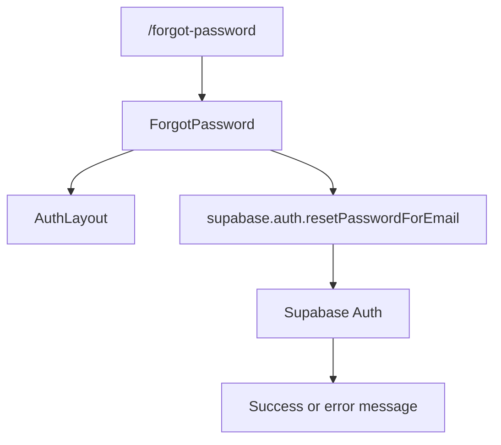

**Purpose:** Send a password reset email to an existing user.

**Frontend Entry Point:** `client/src/pages/auth/ForgotPassword.jsx`

**API Endpoint(s):** None

**Backend Components:** None

**Services Used:** `supabase.auth.resetPasswordForEmail`

**Database Interaction:** None

**Response:** Sends a reset link to the user and shows a success notice if the request is accepted.

**Dependencies:** `AuthLayout`, `AuthField`, `AuthInput`, `AuthMessage`, and `AuthPrimaryButton`.

**Failure Handling:** Shows the Supabase error message inline if reset email delivery fails.

**Implementation Notes:** The reset link redirects to `/reset-password`.

### Password Reset Completion

```mermaid
flowchart TD
  Route["/reset-password"] --> Reset[ResetPassword]
  Reset --> Wait[onAuthStateChange / getSession]
  Wait --> Ready[Recovery session ready]
  Ready --> Update[supabase.auth.updateUser]
  Update --> Supabase[Supabase Auth]
  Supabase --> Redirect[navigate(/app/analyze)]
```

**Purpose:** Complete a password reset after the recovery session is available.

**Frontend Entry Point:** `client/src/pages/auth/ResetPassword.jsx`

**API Endpoint(s):** None

**Backend Components:** None

**Services Used:** `supabase.auth.onAuthStateChange`, `supabase.auth.getSession`, `supabase.auth.updateUser`

**Database Interaction:** None

**Response:** Updates the password and sends the user back into the authenticated app flow.

**Dependencies:** `AuthLayout`, `AuthField`, `AuthInput`, `AuthMessage`, and `AuthPrimaryButton`.

**Failure Handling:** Waits for the recovery session before enabling the form and renders inline errors if the update fails.

**Implementation Notes:** The page depends on Supabase URL-hash recovery handling already enabled in the client configuration.

### Logout

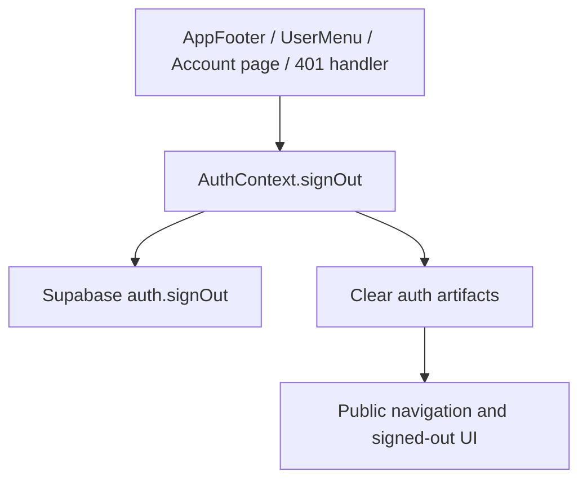

**Purpose:** End the current local Supabase session and return the app to a signed-out state.

**Frontend Entry Point:** `client/src/components/app/AppFooter.jsx`, `client/src/components/app/UserMenu.jsx`, `client/src/pages/app/Account.jsx`, `client/src/api.js`

**API Endpoint(s):** None

**Backend Components:** None

**Services Used:** `AuthContext`, `supabase.auth.signOut`

**Database Interaction:** None

**Response:** Clears the local session, removes session artifacts, and returns the UI to the public experience.

**Dependencies:** `AuthContext`, `AppFooter`, `UserMenu`, and `Account`.

**Failure Handling:** Sign-out is local to the browser session; the app also triggers sign-out when the API returns `401`.

**Implementation Notes:** The implementation uses `supabase.auth.signOut({ scope: "local" })`.

### Protected Session Handling

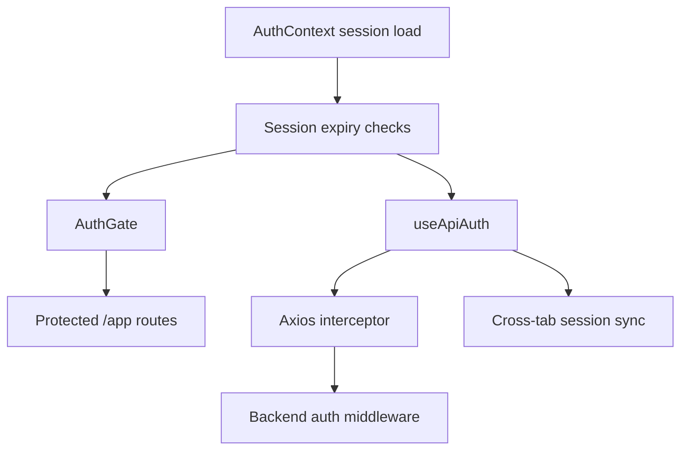

**Purpose:** Keep protected application access tied to a valid Supabase session.

**Frontend Entry Point:** `client/src/contexts/AuthContext.jsx`, `client/src/components/auth/AuthGate.jsx`, `client/src/hooks/useApiAuth.js`

**API Endpoint(s):** Protected API requests that use the shared Axios client

**Backend Components:** `server/middleware/authMiddleware.js`

**Services Used:** `supabase.auth.getSession`, `supabase.auth.getUser`, `sessionSync`, and the shared Axios API client

**Database Interaction:** None

**Response:** Keeps the user on protected routes when the session is valid and sends them back to login when the session is missing, expired, or rejected by the API.

**Dependencies:** `authSession` utilities, `AuthModalContext`, and the API interceptor setup.

**Failure Handling:** Handles missing sessions, expired sessions, inactivity expiry, `401` responses, and cross-tab session updates.

**Implementation Notes:** The implementation enforces both token expiry and browser-side session lifetime checks.

### Resume Analysis

```mermaid
flowchart TD
  Route["/analyze or /app/analyze"] --> Analyze[Analyze]
  Analyze --> Validate[Client-side file and JD validation]
  Validate -->|Guest user| Guest[Sign-in modal]
  Validate -->|Signed in| Submit[api.post('/analyze')]
  Submit --> ApiAuth[Axios auth interceptor]
  ApiAuth --> RouteMW[authMiddleware]
  RouteMW --> Upload[upload.single('file')]
  Upload --> RequestCheck[analysisValidation]
  RequestCheck --> Controller[analysisController.analyze]
  Controller --> Signature[validateFileSignature]
  Signature --> Extract[extractResumeText]
  Extract --> Gemini[analyzeWithGemini]
  Gemini --> Save[Analysis.create]
  Save --> Cleanup[cleanupUploadedFile]
  Cleanup --> Response[Analysis id + analysis]
  Response --> ReportContext[setCurrentReportId / localStorage]
  ReportContext --> Redirect[navigate('/app/report')]
```

**Purpose:** Collect a resume and job description, generate an analysis, save the result, and move the user into the report view.

**Frontend Entry Point:** `client/src/pages/app/Analyze.jsx`

**API Endpoint(s):** `POST /api/analyze`

**Backend Components:** `server/routes/analysisRoutes.js`, `server/middleware/authMiddleware.js`, `server/middleware/upload.js`, `server/middleware/validation/analysisValidation.js`, `server/controllers/analysisController.js`

**Services Used:** `useAbortController`, `useRequestDedupe`, `mapErrorToType`, `failureMessages`, `extractResumeText`, `analyzeWithGemini`, `validateFileSignature`, `cleanupUploadedFile`

**Database Interaction:** Creates an `Analysis` document for the authenticated user.

**Response:** Returns the saved analysis identifier and stored analysis payload, then navigates to the report page.

**Dependencies:** `useAuth`, `useReport`, `StatusSheet`, `StatusInline`, `AtsScore`-adjacent UI, the reading progress UI, and browser storage keys for draft continuity.

**Failure Handling:** Client-side file and job description validation, guest sign-in gating, abort handling, API error mapping, contextual status sheets, inline validation errors, and guaranteed temporary file cleanup.

**Implementation Notes:** The component stores the last job description draft and the most recent analysis payload in browser storage for continuity.

### Report View

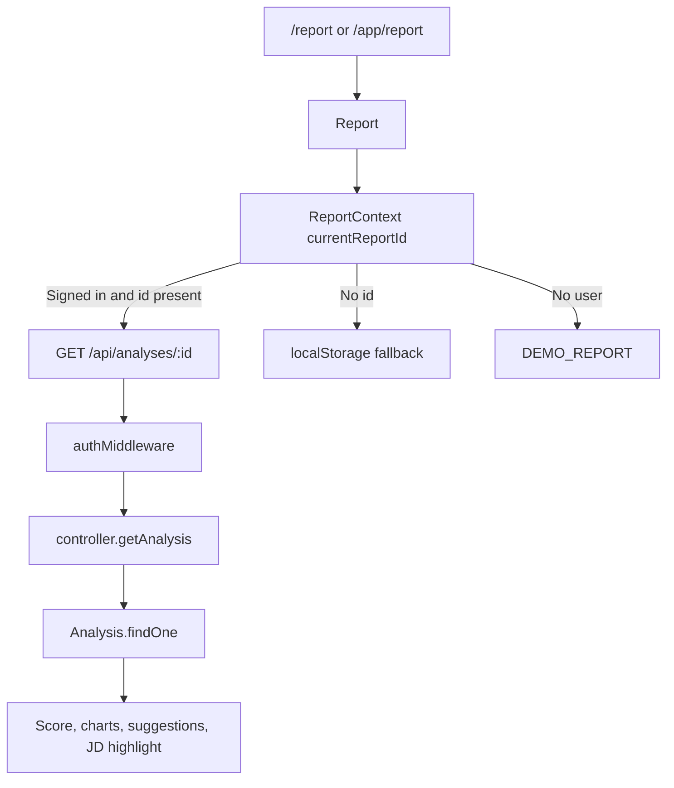

**Purpose:** Render a saved analysis as a report with scores, skills, suggestions, and job description highlighting.

**Frontend Entry Point:** `client/src/pages/app/Report.jsx`

**API Endpoint(s):** `GET /api/analyses/:id`

**Backend Components:** `server/routes/analysisRoutes.js`, `server/middleware/authMiddleware.js`, `server/controllers/analysisController.js`

**Services Used:** `useAbortController`, `mapErrorToType`, `failureMessages`, `AtsScore`, `Recharts`, and clipboard access for copying suggestions

**Database Interaction:** Reads a single `Analysis` document by id and authenticated user.

**Response:** Displays the report cover, score summary, matched and missing skills, charts, suggestions, and highlighted job description text.

**Dependencies:** `useAuth`, `useReport`, `StatusSheet`, `PaperClip`, `Sheet`, `StickyNote`, and shared score helpers.

**Failure Handling:** Shows a demo report for signed-out users, falls back to local storage when no report id is selected, and renders status sheets for loading or API errors.

**Implementation Notes:** The page reads the stored analysis without mutating it and supports copying the suggestions text to the clipboard.

### Dashboard

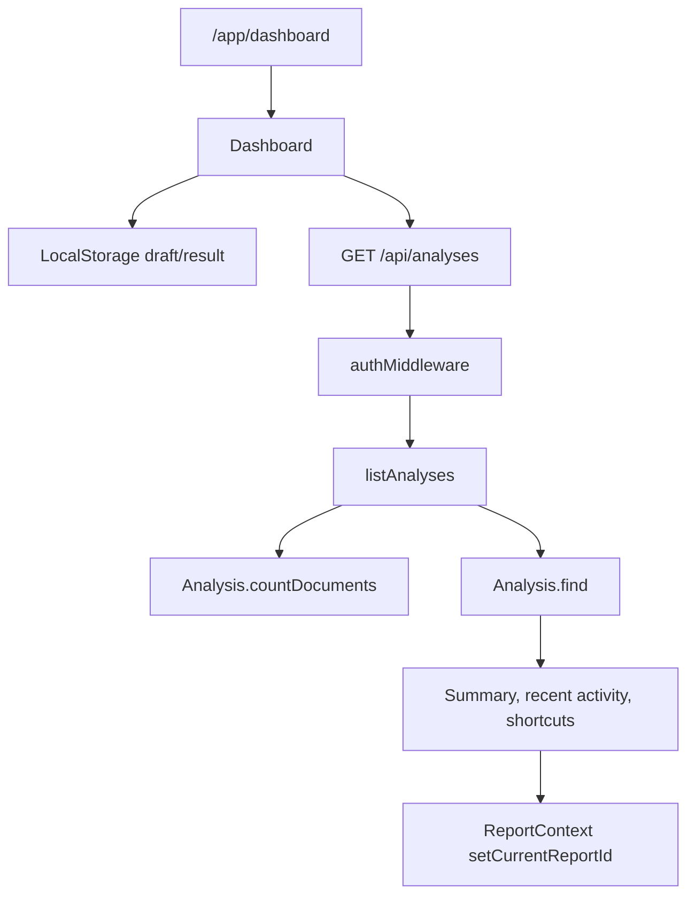

**Purpose:** Provide a private landing page for signed-in users with archive summaries, recent activity, and continuation shortcuts.

**Frontend Entry Point:** `client/src/pages/app/Dashboard.jsx`

**API Endpoint(s):** `GET /api/analyses`

**Backend Components:** `server/routes/analysisRoutes.js`, `server/middleware/authMiddleware.js`, `server/controllers/analysisController.js`

**Services Used:** `useAbortController`, `AtsScore`, `StatusSheet`, `failureMessages`, `mapErrorToType`

**Database Interaction:** Counts and lists the authenticated user's analyses from MongoDB.

**Response:** Shows running totals, recent analyses, a continue-working panel, and quick actions into analysis and history.

**Dependencies:** `useAuth`, `useReport`, `Sheet`, `StickyNote`, `PaperClip`, and the dashboard status components.

**Failure Handling:** Shows loading, empty, and error states; API failures are mapped to structured status sheets.

**Implementation Notes:** The dashboard reads the latest draft job description and latest saved analysis from browser storage.

### History

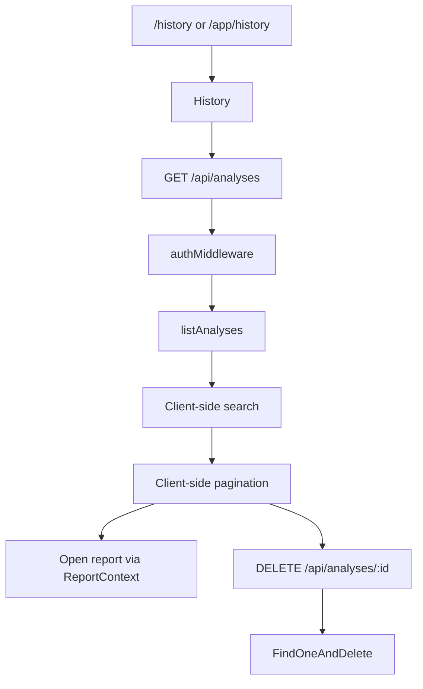

**Purpose:** Let users browse, search, paginate, open, and delete previously saved analyses.

**Frontend Entry Point:** `client/src/pages/app/History.jsx`

**API Endpoint(s):** `GET /api/analyses`, `DELETE /api/analyses/:id`

**Backend Components:** `server/routes/analysisRoutes.js`, `server/middleware/authMiddleware.js`, `server/controllers/analysisController.js`

**Services Used:** `useAbortController`, `useRequestDedupe`, `AtsScore`, `StatusSheet`, `StatusInline`, `failureMessages`, `mapErrorToType`

**Database Interaction:** Reads the authenticated user's analyses and deletes a selected analysis record.

**Response:** Renders the archive list with search, pagination, delete confirmation, and report navigation.

**Dependencies:** `useAuth`, `useReport`, `Sheet`, `StickyNote`, `PaperClip`, and the delete confirmation dialog.

**Failure Handling:** Supports loading, empty, filtered-empty, API error, and delete-error states.

**Implementation Notes:** Search and pagination are client-side only; the backend list route remains unchanged.

### Account

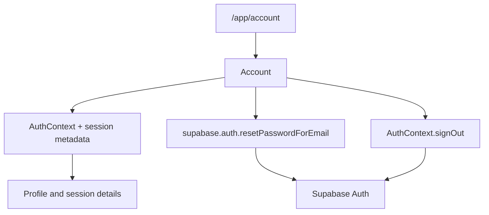

**Purpose:** Show the signed-in user's profile and session details, and provide password reset and sign-out actions.

**Frontend Entry Point:** `client/src/pages/app/Account.jsx`

**API Endpoint(s):** None

**Backend Components:** None

**Services Used:** `useAuth`, `supabase.auth.resetPasswordForEmail`, `sessionSync`, and the session time helpers

**Database Interaction:** None

**Response:** Displays the user's profile, sign-in provider, timestamps, and controls for password reset and sign-out.

**Dependencies:** `Sheet`, `StickyNote`, `PaperClip`, and the account page helpers.

**Failure Handling:** Shows reset-password errors inline and treats sign-out as a local session action.

**Implementation Notes:** The page reads session timestamps from browser storage and Supabase user metadata.

### Status and Recovery

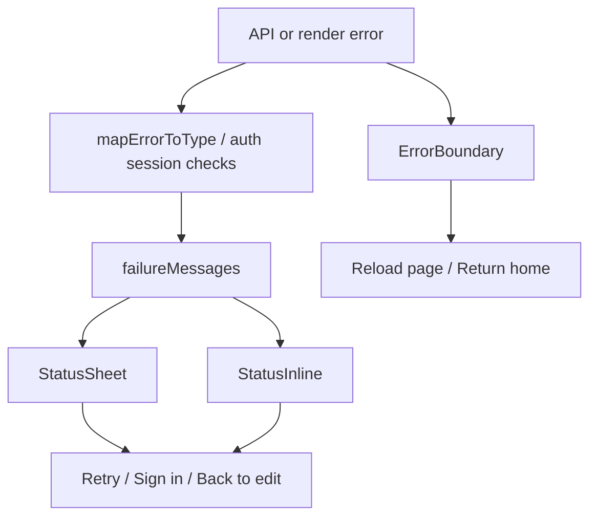

**Purpose:** Present consistent recovery states for loading failures, API failures, validation errors, and unexpected render failures.

**Frontend Entry Point:** `client/src/components/status/StatusSheet.jsx`, `client/src/components/status/StatusInline.jsx`, `client/src/components/ErrorBoundary.jsx`, plus the feature pages that render them

**API Endpoint(s):** Indirectly affects all protected API-backed features

**Backend Components:** Indirectly reflects errors from the protected analysis routes and the backend error middleware

**Services Used:** `mapErrorToType`, `failureMessages`

**Database Interaction:** None

**Response:** Shows contextual retry, sign-in, back-to-edit, reload, or return-home actions depending on the failure state.

**Dependencies:** Used by Analyze, Dashboard, History, Report, and the public preview pages where applicable.

**Failure Handling:** Covers offline, timeout, service unavailable, session expired, validation, and render-level failures.

**Implementation Notes:** The same status primitives are reused across multiple pages to keep recovery behavior consistent.
