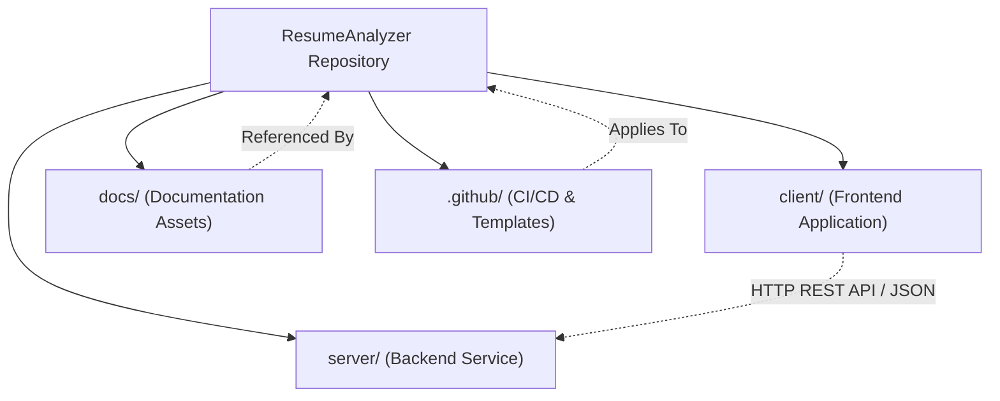
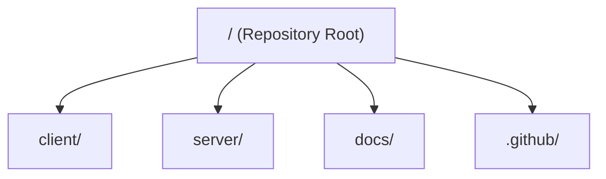
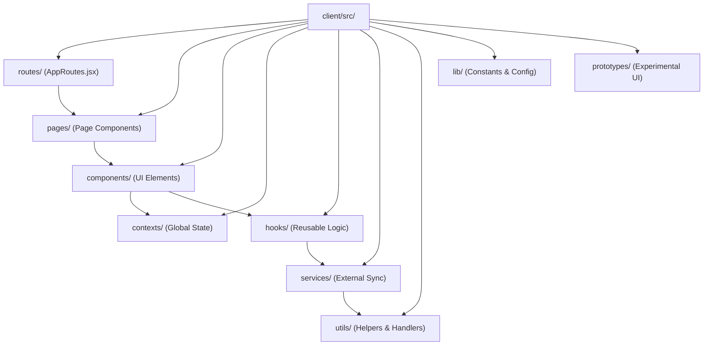
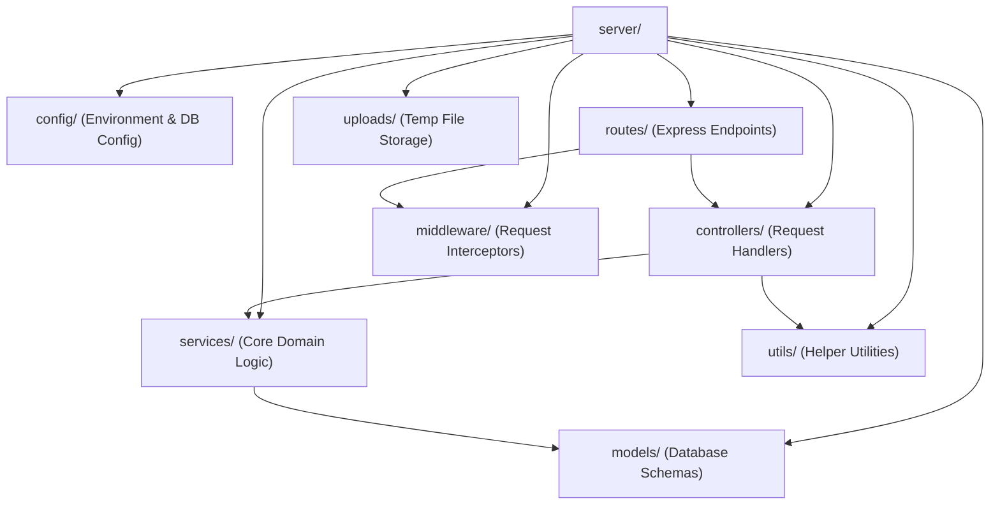
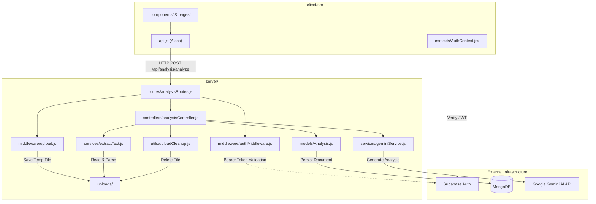
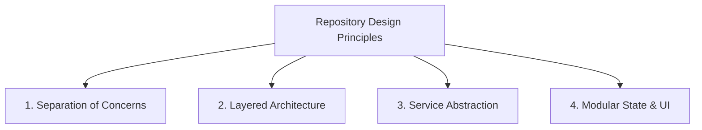
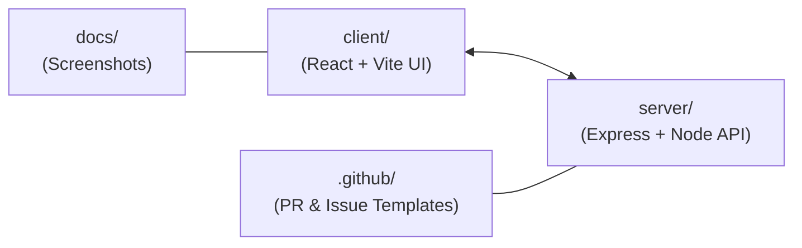

# Folder Responsibilities

## 1. Purpose

The purpose of this document is to define the ownership, architectural boundaries, and directory responsibilities across the entire repository. It establishes why each major folder exists, what code and assets belong within it, what must not be placed there, and how directories interact with one another.

This document serves as the authoritative guide for maintaining clean separation of concerns and structural consistency as the codebase evolves.

---

## 2. Repository Responsibility Map

The repository is organized into distinct top-level directories that isolate the frontend presentation layer (`client/`), the backend service API (`server/`), visual documentation assets (`docs/`), and GitHub repository governance configurations (`.github/`).

---

## 3. Top-Level Responsibilities

### `client/`

* **Purpose**: Houses the user-facing web application built with React, Vite, and CSS modules.
* **Primary Responsibility**: Delivering the interactive user interface, handling client-side routing, managing local and contextual state, performing client-side authentication flows, and consuming backend REST APIs.
* **What Belongs There**: React components, pages, custom hooks, React contexts, client-side API clients, static frontend assets, and Vite build configuration.
* **What Does NOT Belong There**: Express routes, Node.js server logic, database models, direct database connections, or AI API secrets.
* **Related Components**: Interacts with `server/` via HTTP REST requests defined in `client/src/api.js`.

### `server/`

* **Purpose**: Houses the backend API service built with Node.js, Express, and Mongoose.
* **Primary Responsibility**: Processing resume document uploads, parsing text content, communicating with Google Gemini AI APIs, managing MongoDB persistence, validating environment variables, and enforcing rate limiting and authentication middleware.
* **What Belongs There**: Express routing definitions, controller logic, custom middleware, Mongoose schemas, text extraction services, Gemini integration services, server configuration, and file cleanup utilities.
* **What Does NOT Belong There**: React JSX components, frontend styles, browser DOM manipulation logic, or client build artifacts.
* **Related Components**: Exposes HTTP endpoints consumed by `client/` and communicates with external services including MongoDB, Google Gemini API, and Supabase Auth.

### `docs/`

* **Purpose**: Stores visual assets and media used in project documentation.
* **Primary Responsibility**: Serving as a central repository for application screenshots and architectural diagrams referenced within root documentation files.
* **What Belongs There**: Visual documentation images, screenshots, and diagrams.
* **What Does NOT Belong There**: Source code, executable scripts, application assets, or configuration files.
* **Related Components**: Referenced by `README.md` and repository architectural guides.

### `.github/`

* **Purpose**: Configures GitHub platform settings, issue tracking standards, and contribution templates.
* **Primary Responsibility**: Providing standardized issue and pull request templates to enforce code quality and consistent contribution practices.
* **What Belongs There**: `PULL_REQUEST_TEMPLATE.md`, `ISSUE_TEMPLATE/` forms, and GitHub workflow configurations.
* **What Does NOT Belong There**: Application source code, runtime environment secrets, or client/server build scripts.
* **Related Components**: Oversees repository maintenance and contributor workflows (`CONTRIBUTING.md`).

---

## 4. Frontend Responsibility Boundaries

The frontend codebase (`client/src/`) follows a modular, layer-based responsibility structure:

### Implemented Frontend Directories

* **`routes/`**: Owns top-level client routing definitions (`AppRoutes.jsx`). Responsible for mapping browser URL paths to page components and managing protected routing rules.
* **`pages/`**: Owns full-page view components (e.g., Landing, Features, FAQ, App workspace, Auth pages, NotFound). Responsible for orchestrating page layouts, reading route params, and coordinating domain components.
* **`components/`**: Owns reusable presentation elements categorized by feature domain (`app/`, `auth/`, `charts/`, `hero/`, `landing/`, `status/`, `ErrorBoundary.jsx`, `ScrollToTop.jsx`). Responsible solely for UI rendering and component-level user interactions.
* **`contexts/`**: Owns global React state providers (`AuthContext.jsx`, `AuthModalContext.jsx`, `ReportContext.jsx`). Responsible for sharing state (user authentication, active modals, analysis reports) across distant component trees.
* **`hooks/`**: Owns custom React hooks (`useApiAuth.js`, `useAbortController.js`). Responsible for encapsulating stateful business logic, network call aborts, and auth integration hooks.
* **`services/`**: Owns frontend service layer integrations (`sessionSync.js`, `supabase/`). Responsible for synchronizing user sessions with external authentication providers.
* **`utils/`**: Owns pure utility functions (`authSession.js`, `envValidation.js`, `errorMapper.js`, `errors.js`). Responsible for data formatting, token storage helpers, environment verification, and error parsing.
* **`lib/`**: Owns static application definitions and error message templates (`failureMessages.js`).
* **`prototypes/`**: Owns experimental UI components and design iterations.

*Note: A dedicated `layouts/` directory is not implemented in `client/src/`; layout management is handled directly within `pages/` and `components/`.*

---

## 5. Backend Responsibility Boundaries

The backend service (`server/`) separates concerns into distinct architectural layers:

### Implemented Backend Directories

* **`config/`**: Owns application configuration and database connection initialization (`config/index.js`). Responsible for loading environment settings and establishing Mongoose/MongoDB connections.
* **`routes/`**: Owns Express HTTP route definitions (`analysisRoutes.js`). Responsible for declaring API paths, HTTP methods, and binding middleware and controller functions to routes.
* **`controllers/`**: Owns HTTP request and response handlers (`analysisController.js`). Responsible for parsing incoming request payloads, delegating execution to services, formatting HTTP responses, and managing status codes.
* **`middleware/`**: Owns request interception handlers (`authMiddleware.js`, `rateLimiter.js`, `upload.js`, `errorMiddleware.js`, `validation/`). Responsible for verifying authentication tokens, enforcing rate limits, parsing multipart file uploads, validating request inputs, and handling global errors.
* **`services/`**: Owns core business and processing logic (`extractText.js`, `geminiService.js`). Responsible for parsing text from PDF/DOCX files and orchestrating structured prompt interactions with Google Gemini AI.
* **`models/`**: Owns database schema definitions (`Analysis.js`). Responsible for defining Mongoose document structures, indexes, and persistence logic for resume analysis results.
* **`utils/`**: Owns backend utility modules (`envValidation.js`, `logger.js`, `uploadCleanup.js`). Responsible for logging, file deletion after processing, and environment schema checks.
* **`uploads/`**: Owns temporary filesystem storage for uploaded resume files awaiting text extraction and cleanup.

---

## 6. Cross-Folder Relationships

### Implemented Interactions

1. **Client API Consumption**: Components in `client/src/components/` trigger asynchronous API calls via `client/src/api.js`, which issues HTTP requests to `server/routes/analysisRoutes.js`.
2. **Authentication Pipeline**: `client/src/contexts/AuthContext.jsx` manages user credentials using Supabase Auth. The client passes the JWT Bearer token across the network, where `server/middleware/authMiddleware.js` intercepts and validates it before route access is granted.
3. **File Processing Pipeline**:
   * `client/src/components/app/` posts a resume file payload to the backend.
   * `server/middleware/upload.js` receives the file and temporarily stores it in `server/uploads/`.
   * `server/controllers/analysisController.js` passes the file path to `server/services/extractText.js` for text extraction.
   * `server/services/geminiService.js` constructs the analysis prompt and sends it to the Google Gemini AI API.
   * `server/models/Analysis.js` saves the resulting analysis data to MongoDB.
   * `server/utils/uploadCleanup.js` deletes the temporary file from `server/uploads/`.

---

## 7. Design Principles

The repository structure reflects the following core design principles observed in the implementation:

* **Separation of Concerns**: Clear boundary between presentation (`client/`) and backend processing (`server/`). The frontend never directly accesses database models or AI service credentials; all sensitive operations are encapsulated in the server layer.
* **Layered Architecture**: The backend strictly enforces a layered flow where HTTP routes delegate to middleware and controllers, controllers delegate heavy processing to domain services, and services interact with models and external APIs.
* **Service Abstraction**: Complex third-party integrations—such as Google Gemini AI API calls (`geminiService.js`), file parsing engines (`extractText.js`), and Supabase authentication (`supabase/`)—are isolated in dedicated service modules rather than coupled directly to UI or route handlers.
* **Modular UI and State Domain Isolation**: Frontend components are grouped into functional domain subdirectories (`app/`, `auth/`, `charts/`, `landing/`, `status/`), keeping UI concerns localized and state managed through targeted React Contexts (`AuthContext`, `ReportContext`).

---

## 8. Summary

The repository maintains an explicit structural organization:

* **`client/`**: Owns all frontend presentation, browser routing, user experience, and client state.
* **`server/`**: Owns all backend API endpoints, document parsing pipelines, AI service integrations, database persistence, and request validation.
* **`docs/`**: Owns media assets for visual documentation.
* **`.github/`**: Owns repository contribution standards and issue templates.

Each directory maintains strict ownership boundaries, ensuring high maintainability, clear dependency flows, and strong separation of concerns across the codebase.
