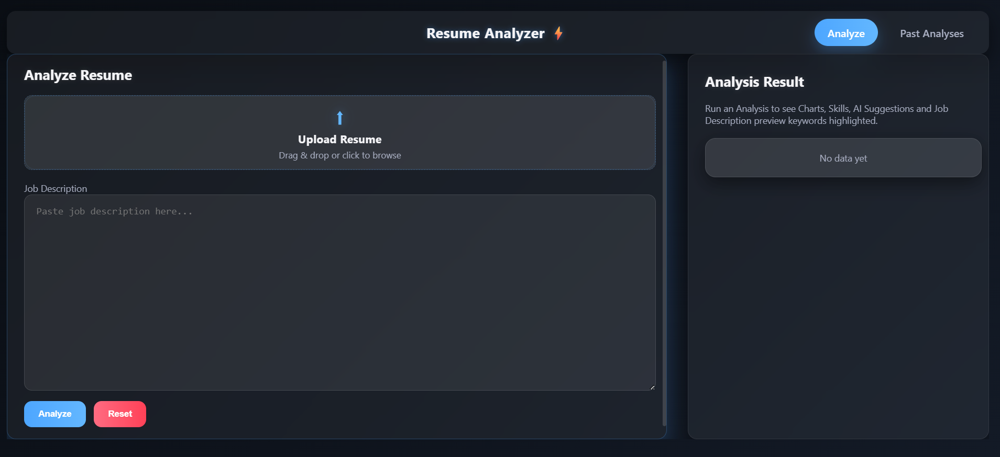
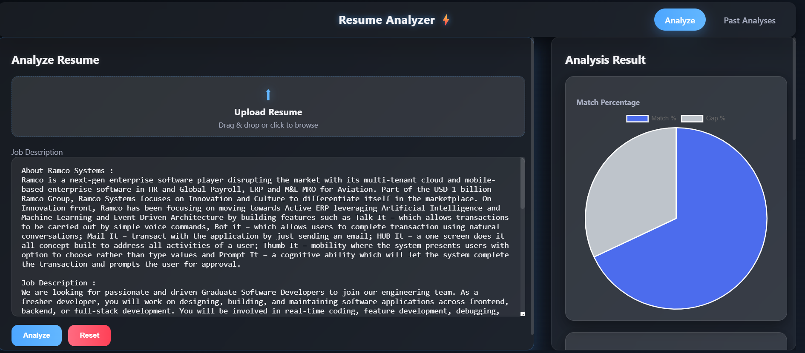
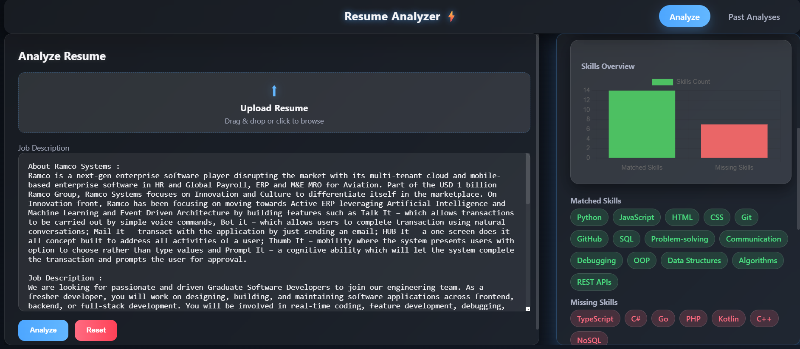
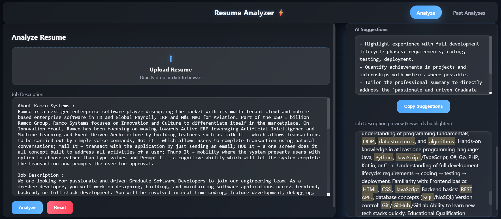
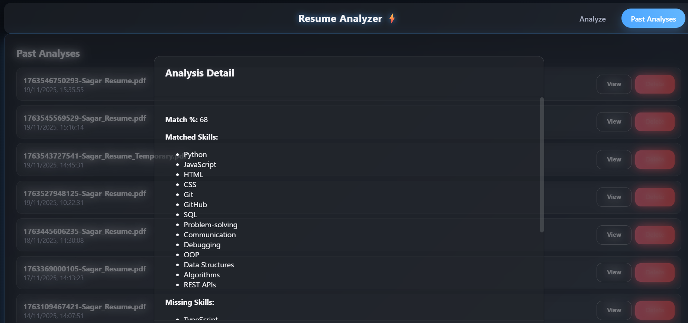

📘 Resume Analyzer 
🚀 AI-powered Resume vs Job Description Analysis System

Built using
React + Vite + Node.js + Express + MongoDB + Google Gemini AI
with a modern futuristic glassmorphism UI.

📸 Project Preview

These are my Application Previews.
client/public/assets/

🔹 Dashboard

🔹 Resume Analysis Screen Pic Chart

🔹 Resume Analysis Screen Skills Chart

🔹 Resume Analysis Screen Ai Suggestions

🔹 Past Analyses (History)

⭐ Features
🔍 AI Resume–JD Matching

Uses Gemini 2.0 Flash to compare Resume text vs Job Description

Calculates Match %

Extracts Matched Skills and Missing Skills

🧠 AI Suggestions

Skill improvement ideas

Weakness identification

“What to add or change in your résumé”

📊 Interactive Charts

Match % Pie Chart

Skills Bar Chart
(via Chart.js)

🗂 Past Analyses

Every analysis stored in MongoDB

View previous reports in a modal with full details

⚡ Modern UI

Futuristic glassmorphism

Neon glow effects

Fully responsive

Dark theme with soft-blue accents

🧰 Tech Stack
Frontend

React (Vite)

Axios

Chart.js + react-chartjs-2

Custom CSS (glassmorphism)

Backend

Node.js

Express.js

Google Gemini AI SDK

MongoDB + Mongoose

Tools / Libraries

Multer (resume upload)

pdf-parse (text extraction from PDF)

CORS

dotenv

Nodemon

🛠 1. Complete Installation Guide (End-to-End Setup)

Follow these steps exactly.

✔ Step 1 — Install Required Software
👉 Install Node.js

https://nodejs.org/

node -v
npm -v

👉 Install MongoDB

Local DB: https://www.mongodb.com/try/download/community

Start MongoDB service:

mongod

Or use MongoDB Atlas.

✔ Step 2 — Create Project Structure
ResumeAnalyzer/
│
├── client/   ← React + Vite
└── server/   ← Node + Express

If not created:

mkdir ResumeAnalyzer
cd ResumeAnalyzer
mkdir client server

✔ Step 3 — Setup Client (React + Vite)
cd client
npm create vite@latest .
npm install

Install UI dependencies:

npm install axios chart.js react-chartjs-2

✔ Step 4 — Setup Server (Node + Express)
cd ../server
npm init -y
npm install express mongoose multer cors dotenv axios

Dev tool:

npm install nodemon --save-dev

Add in package.json:

"scripts": {
  "start": "node server.js",
  "dev": "nodemon server.js"
}

✔ Step 5 — Install PDF Text Extraction
npm install pdf-parse

Make sure your extractText.js uses it.

✔ Step 6 — Install Google Gemini SDK
npm install @google/generative-ai

✔ Step 7 — Create .env Files
Inside server/.env:
PORT=5000
MONGO_URI=your_mongodb_url
GEMINI_API_KEY=your_google_api_key

Inside client/.env:
VITE_API_BASE_URL=http://localhost:5000

✔ Step 8 — Start Backend
cd server
npm run dev

Expected:

Server running on port 5000
Connected to MongoDB

✔ Step 9 — Start Frontend
cd client
npm run dev

Open browser:

http://localhost:5173

🚀 2. Deployment Guide
Deploy Backend (Node.js + Express) on Render

Push code to GitHub

Go to https://render.com

Create → Web Service

Select server/ folder

Build command:

npm install

Start command:

npm start

Add env vars

Deploy 🎉

Deploy Frontend (React + Vite) on Vercel

Go to https://vercel.com

Import GitHub repository

Select client folder

Configure:

Framework: Vite

Build command: npm run build

Output: dist

Add env:

VITE_API_BASE_URL=https://your-backend.onrender.com

Deploy 🎉

📡 API Endpoints
➤ POST /analyze

Uploads resume + JD and runs Gemini AI.

➤ GET /analyses

Returns list of all stored analyses.

➤ GET /analyses/:id

Returns a single past analysis.

📂 Folder Structure
ResumeAnalyzer/
│
├── client/
│   ├── public/
│   │   └── assets/
│   │       ├── preview-1.png
│   │       ├── preview-2.png
│   │       └── preview-3.png
│   ├── src/
│   │   ├── components/
│   │   │   ├── AnalyzeForm.jsx
│   │   │   ├── ResultsPanel.jsx
│   │   │   ├── Navbar.jsx
│   │   │   ├── PastAnalysesList.jsx
│   │   │   ├── AnalysisDetail.jsx
│   │   ├── styles.css
│   ├── package.json
│
└── server/
    ├── controllers/
    ├── middleware/
    ├── models/
    ├── routes/
    ├── services/
    ├── uploads/
    ├── server.js
    ├── package.json
    ├── .env

❤️ Credits

Developed by Sagar Puppala
AI-Powered Resume Screening System

📄 License

MIT License — free to use & modify.
