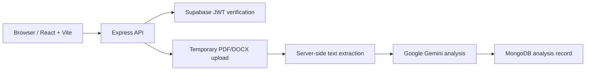
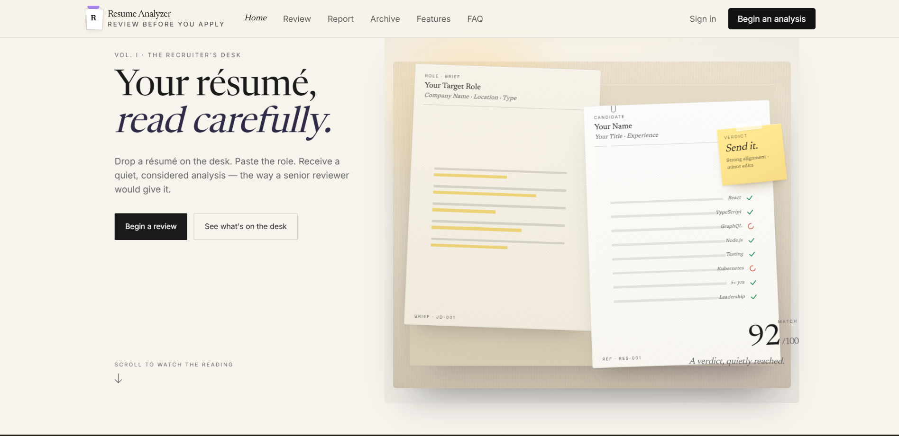
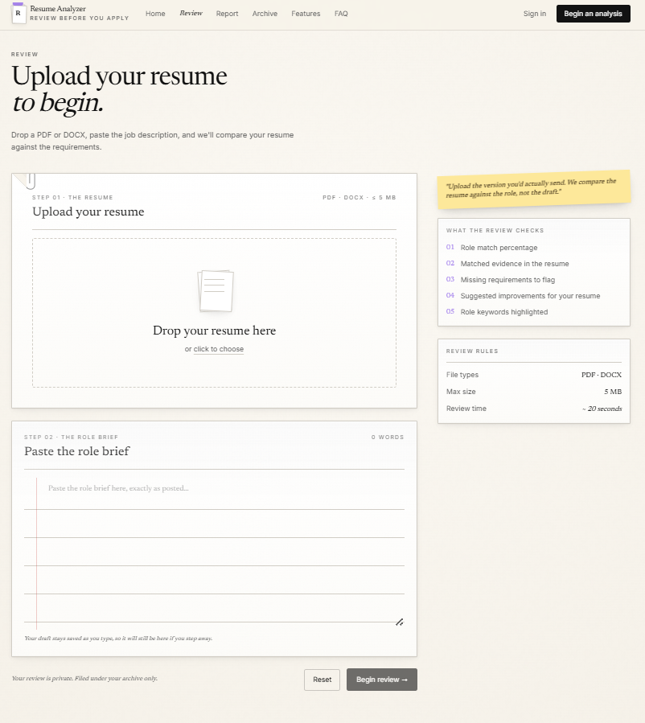
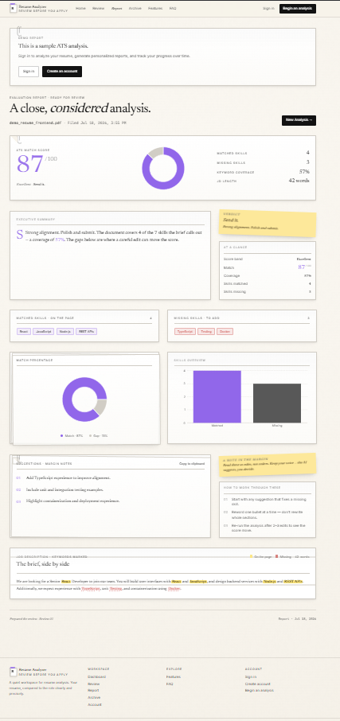
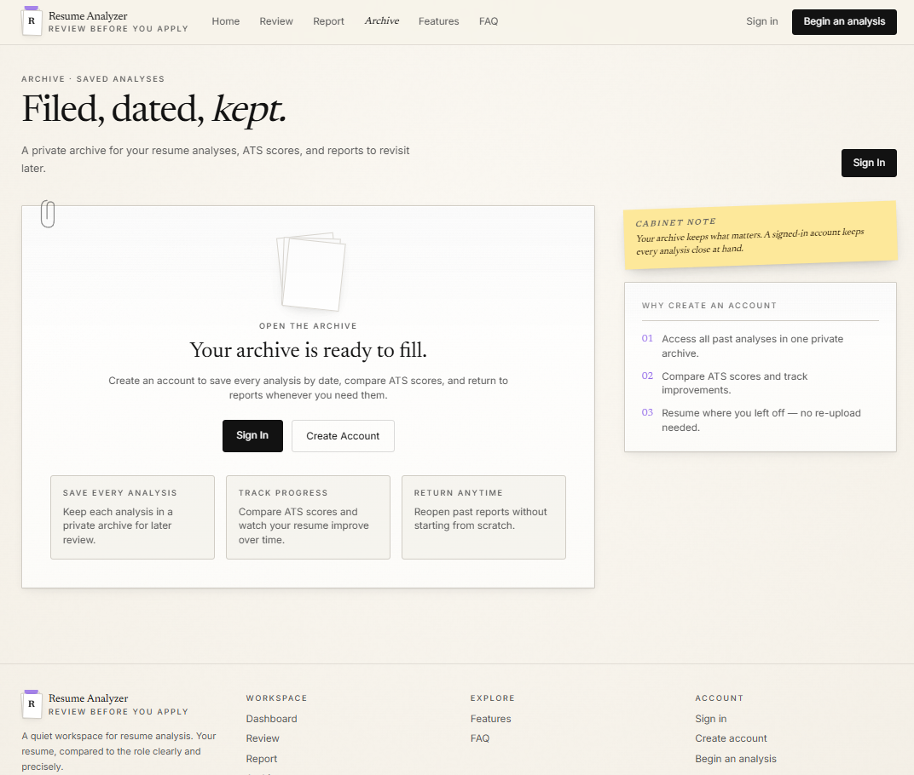
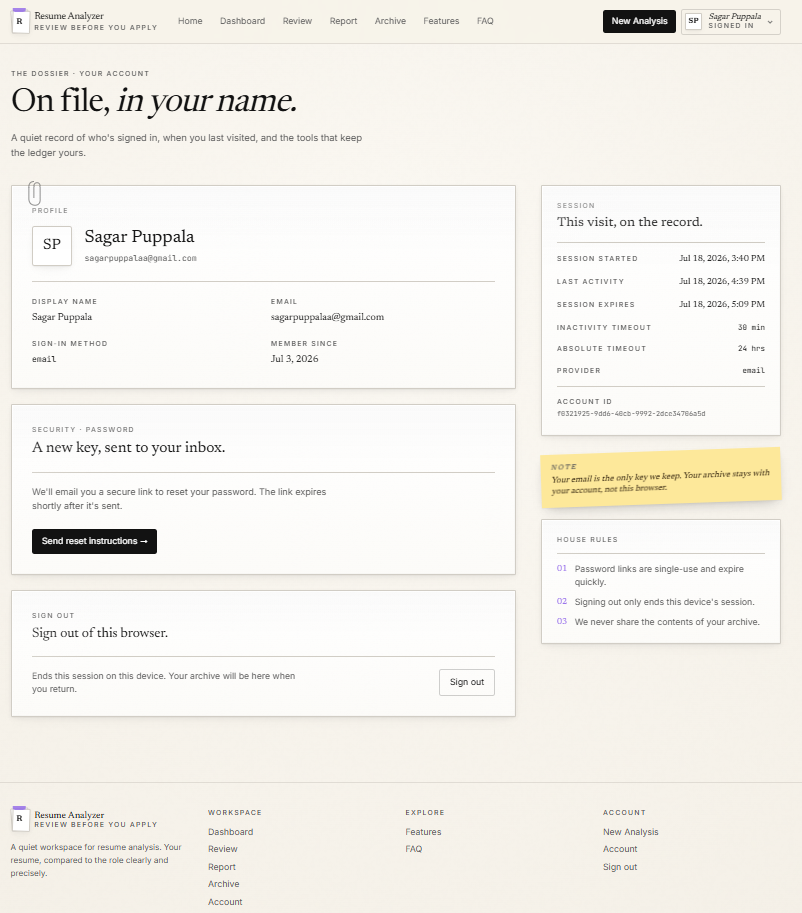

<p align="center">
  
</p>

<h1 align="center">Resume Analyzer</h1>

<p align="center"><strong>AI-powered resume analysis for private, per-user job matching archives.</strong></p>

Resume Analyzer is a React + Express application that compares a resume against a job description, returns structured analysis, and stores each result in a private per-user archive.

No public live demo URL is published in this repository.

## Technology Stack

<p align="center">
  
  
  
  
  
</p>
<p align="center">
  
  
  
  
  
</p>

## Repository Status

<p align="center">
  
  
</p>

## Overview

- Public routes provide the landing page, feature overview, FAQ, and preview versions of the review screens.
- Protected `/app/*` routes provide the authenticated dashboard, review, report, history, and account views.
- The frontend uses Supabase Auth for sign up, sign in, password reset, session sync, and route protection.
- The backend validates the Supabase access token on protected routes, extracts text from uploaded resumes, sends only the extracted text to Gemini, and stores the resulting analysis in MongoDB.

## Documentation

> Engineering Documentation
>
> Browse the complete engineering documentation including architecture, workflows, deployment, database schema, UI architecture, and release notes.
>
> [Documentation Portal](docs/README.md)

## Architecture


```mermaid
flowchart LR
  Browser[Browser / React + Vite] --> API[Express API]
  API --> Auth[Supabase JWT verification]
  API --> Upload[Temporary PDF/DOCX upload]
  Upload --> Extract[Server-side text extraction]
  Extract --> Gemini[Google Gemini analysis]
  Gemini --> MongoDB[MongoDB analysis record]
```

## Routes

### Public pages

- `/`
- `/landing-v2`
- `/features`
- `/faq`
- `/analyze`
- `/report`
- `/history`
- `/login`
- `/signup`
- `/forgot-password`
- `/reset-password`

The public `/analyze`, `/report`, and `/history` routes render preview or empty states when the user is not signed in.

### Protected app pages

- `/app`
- `/app/dashboard`
- `/app/analyze`
- `/app/report`
- `/app/history`
- `/app/account`

### API routes

- `POST /api/analyze`
- `GET /api/analyses`
- `GET /api/analyses/:id`
- `DELETE /api/analyses/:id`
- `GET /api/health`

## Features

- Supabase authentication with sign up, sign in, password reset, and sign out
- Protected API access using Supabase bearer tokens
- Session expiry handling and cross-tab session sync
- Temporary resume uploads for PDF and DOCX files only
- Server-side file signature validation before extraction
- Text extraction with `pdf-parse` and `mammoth`
- Gemini analysis with structured JSON output
- Fallback model chain for analysis requests
- MongoDB persistence for per-user analysis history
- Dashboard, report, history, and account pages
- Client-side archive search and pagination
- Route-level rate limiting, Helmet, and CORS allowlisting
- Automatic cleanup of uploaded files after success or failure
- Client and server environment validation at startup
- Development health endpoint for backend checks

## Validation and Limits

- Resume uploads are limited to PDF and DOCX files.
- Resume uploads are limited to 5 MB.
- Only one file is accepted per analysis request.
- Job descriptions are limited to 10,000 characters.
- PDF extraction is limited to 50 pages.
- Text extraction uses a 30 second timeout.
- Extracted resume text is capped at 500,000 characters before analysis.

## Screenshots

The repository includes reference screenshots in `docs/screenshots/`:

| Home | Review |
| --- | --- |
|  |  |

| Report | Archive |
| --- | --- |
|  |  |

| Account |
| --- |
|  |

## Repository Structure

```text
ResumeAnalyzer/
|-- README.md
|-- CHANGELOG.md
|-- CONTRIBUTING.md
|-- SECURITY.md
|-- LICENSE
|-- client/
|   |-- package.json
|   |-- vite.config.js
|   `-- src/
|       |-- api.js
|       |-- App.jsx
|       |-- main.jsx
|       |-- components/
|       |   |-- app/
|       |   |-- auth/
|       |   |-- public/
|       |   `-- status/
|       |-- contexts/
|       |-- hooks/
|       |-- pages/
|       |   |-- app/
|       |   |-- auth/
|       |   |-- Features.jsx
|       |   |-- FAQ.jsx
|       |   |-- LandingV2.jsx
|       |   `-- NotFound.jsx
|       |-- routes/
|       |-- services/
|       `-- utils/
`-- server/
    |-- package.json
    |-- server.js
    |-- config/
    |-- controllers/
    |-- middleware/
    |-- models/
    |-- routes/
    |-- services/
    `-- utils/
```

## Local Setup

### Prerequisites

- Node.js 18 or later
- MongoDB connection string
- Supabase project
- Google Gemini API key

### Frontend

```bash
cd client
npm install
npm run dev
```

### Backend

```bash
cd server
npm install
npm run dev
```

Start the backend before the frontend so the API is available when the client loads.

## Environment Variables

### `client/.env.example`

| Variable | Required | Purpose |
| --- | --- | --- |
| `VITE_API_URL` | Yes | Base URL for the backend API |
| `VITE_SUPABASE_URL` | Yes | Supabase project URL |
| `VITE_SUPABASE_ANON_KEY` | Yes | Supabase anonymous key used by the browser |

### `server/.env.sample`

| Variable | Required | Purpose |
| --- | --- | --- |
| `MONGODB_URI` | Yes | MongoDB connection string |
| `GEMINI_API_KEY` | Yes | Google Gemini API key |
| `JWT_SECRET` | Yes | Required by server startup validation |
| `SUPABASE_URL` | Yes | Supabase project URL |
| `SUPABASE_SERVICE_ROLE_KEY` | Yes | Supabase service role key used by the API server |
| `ALLOWED_ORIGINS` | Yes in production | Comma-separated list of allowed frontend origins |
| `PORT` | No | Backend port, defaults to `5000` |
| `NODE_ENV` | No | Runtime environment |

## Deployment

This repository does not include deployment manifests. Deploy the two applications separately:

- Build the frontend with `npm run build` inside `client/` and serve the generated `client/dist` output from a static host.
- Run the backend from `server/server.js` in a Node environment that can reach MongoDB and Supabase.
- Set `ALLOWED_ORIGINS` in production to the exact frontend origins that should be allowed by CORS.
- Keep `SUPABASE_SERVICE_ROLE_KEY`, `GEMINI_API_KEY`, and `MONGODB_URI` out of the browser environment.

## Contributing

See [CONTRIBUTING.md](CONTRIBUTING.md) for local setup, branching guidance, coding standards, and manual verification steps.

## Security

See [SECURITY.md](SECURITY.md) for the security policy, supported versions, and reporting guidance.

## License

See [LICENSE](LICENSE) for the MIT license terms.
