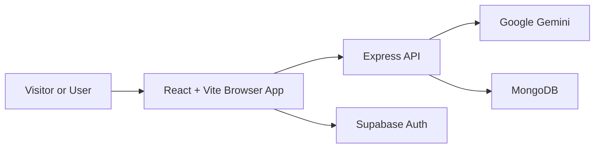

## 1. Purpose

Resume Analyzer is a web application for comparing a resume against a job description, generating structured analysis, and storing the result in a private user archive.

## 2. Product Overview

The product combines a React frontend, an Express backend, Supabase-based authentication, server-side document extraction, Gemini-powered analysis, and MongoDB persistence. It supports both public preview pages and authenticated application pages.

## 3. Problem Statement

The application helps users evaluate how well a resume matches a specific role description. It provides a structured comparison output instead of requiring users to manually inspect keyword overlap, missing skills, and suggested changes.

## 4. Target Users

- Authenticated users who want to compare a resume to a job description
- Users who want to keep a private history of previous analyses
- Visitors who browse the public marketing and preview pages

## 5. Core Capabilities

- Public landing, features, FAQ, and preview pages
- Supabase sign up, sign in, password reset, and sign out
- Protected `/app/*` routes for dashboard, review, report, history, and account views
- Resume upload for PDF and DOCX files
- Job description input and validation
- Server-side text extraction from uploaded documents
- Gemini-based analysis with structured JSON output
- Private per-user archive of saved analyses
- Analysis history browsing, report viewing, and deletion
- Cross-tab session synchronization and session expiry handling
- Route-level rate limiting, upload validation, and temporary file cleanup

## 6. High-Level Workflow

1. The user opens the public site or signs in to the authenticated app.
2. The user uploads a PDF or DOCX resume and provides a job description.
3. The frontend sends the request to the Express API with the Supabase access token.
4. The backend validates the request, stores the upload temporarily, and checks the file signature.
5. The backend extracts text from the document and sends the extracted text plus the job description to Gemini.
6. The backend stores the returned analysis in MongoDB under the authenticated user.
7. The frontend displays the report and can later retrieve the saved analysis from history or the dashboard.

## 7. System Components

- `client/`
  - React application entry point, router, pages, components, contexts, hooks, services, and utilities
  - Public pages, auth screens, protected app pages, shared layouts, and status/error UI
- `server/`
  - Express server entry point, API routes, controllers, middleware, services, models, config, and utilities
  - Authentication checks, file upload handling, document extraction, Gemini integration, MongoDB persistence, and cleanup
- `.github/`
  - Issue templates and pull request template
- `docs/screenshots/`
  - Reference screenshots used by the repository documentation

## 8. Technology Stack

- Frontend: React 18, Vite 8, React Router, Axios, Framer Motion, Recharts, Tailwind CSS 4
- Backend: Node.js, Express, Mongoose, Multer, Helmet, CORS, express-rate-limit, dotenv, nodemon
- Document processing: `pdf-parse`, `mammoth`
- Authentication client: `@supabase/supabase-js`
- AI client: `@google/generative-ai`

## 9. External Services

- Supabase Auth
  - Used by the frontend for session management and by the backend for access-token verification
- MongoDB
  - Used by the backend to persist saved analysis records
- Google Gemini
  - Used by the backend to generate structured resume analysis

## 10. Repository Structure

```text
ResumeAnalyzer/
|-- SYSTEM_OVERVIEW.md
|-- README.md
|-- CHANGELOG.md
|-- CONTRIBUTING.md
|-- SECURITY.md
|-- LICENSE
|-- client/
|   |-- package.json
|   |-- vite.config.js
|   `-- src/
|       |-- App.jsx
|       |-- api.js
|       |-- main.jsx
|       |-- components/
|       |-- contexts/
|       |-- hooks/
|       |-- pages/
|       |-- routes/
|       |-- services/
|       `-- utils/
|-- server/
|   |-- package.json
|   |-- server.js
|   |-- config/
|   |-- controllers/
|   |-- middleware/
|   |-- models/
|   |-- routes/
|   |-- services/
|   `-- utils/
|-- docs/
|   `-- screenshots/
`-- .github/
    |-- ISSUE_TEMPLATE/
    `-- PULL_REQUEST_TEMPLATE.md
```

## 11. Project Scope

The repository focuses on authenticated resume-to-job-description analysis, saved analysis history, report viewing, account management, and public preview pages. It does not define additional product modules beyond the client application, API server, and supporting repository documentation.

## 12. Current Release

Current production release: `1.0.0`

Release date: `2026-07-18`
