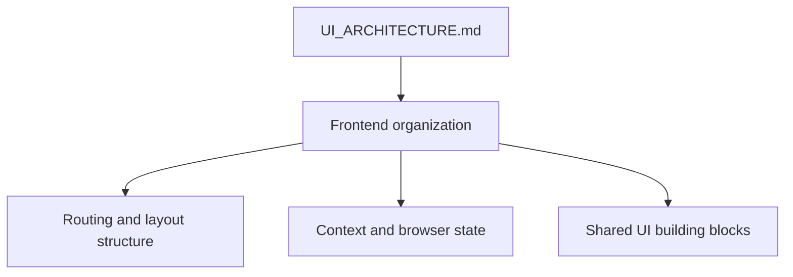
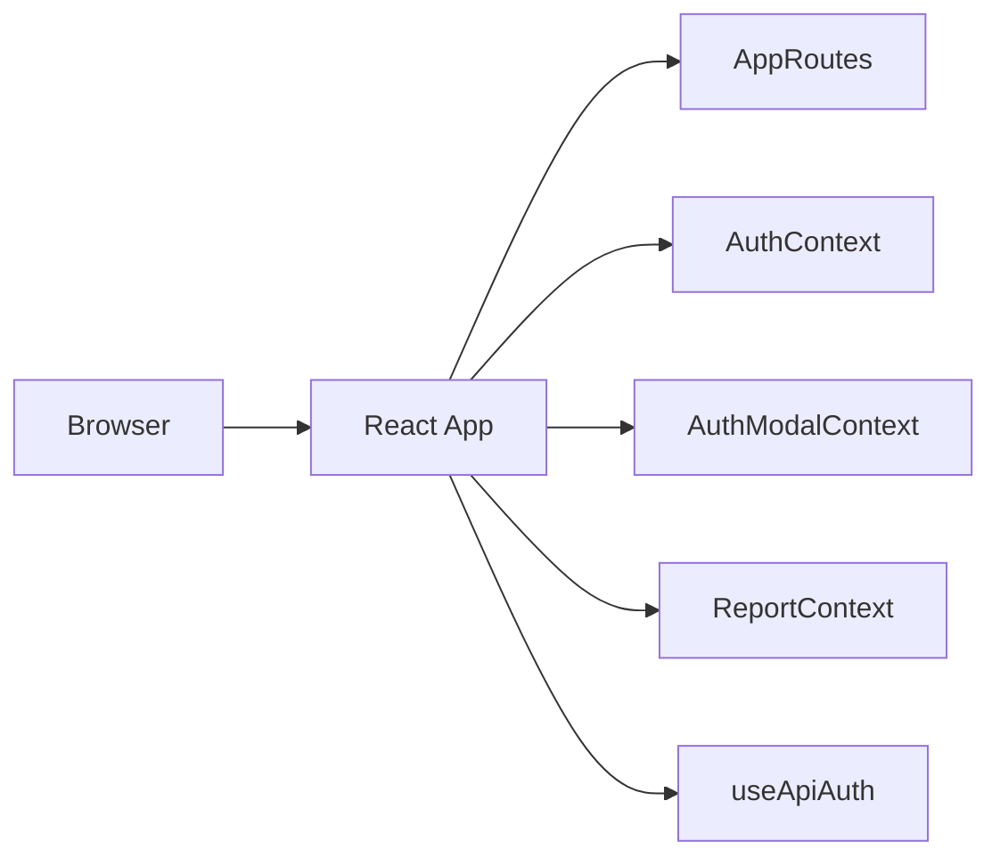
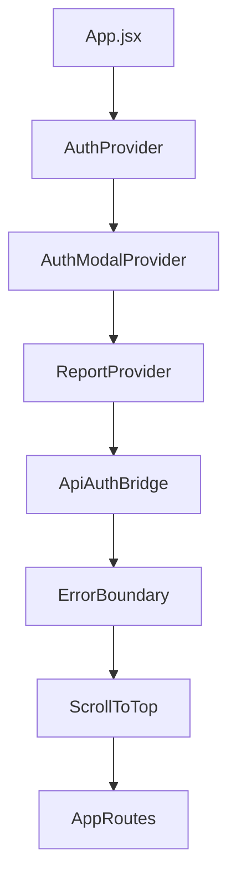
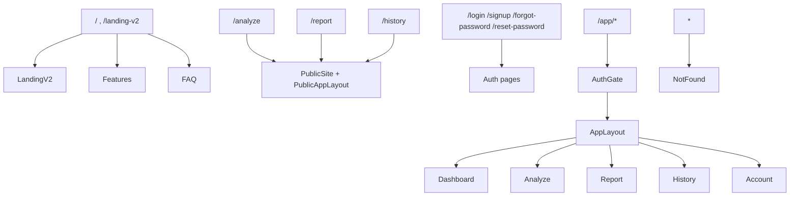
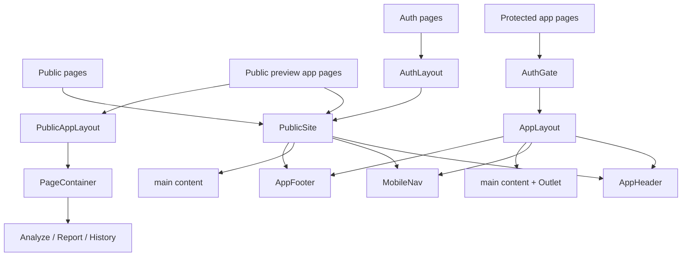
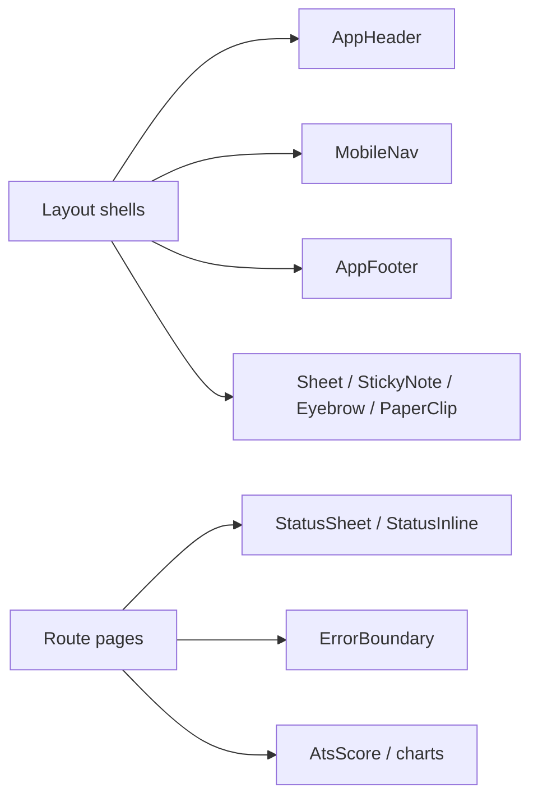
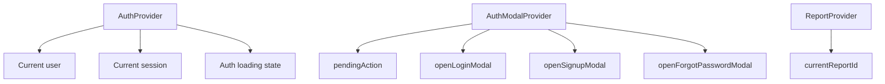
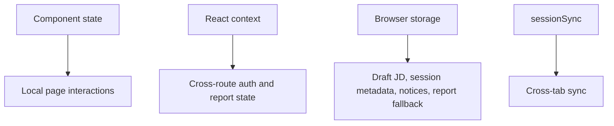
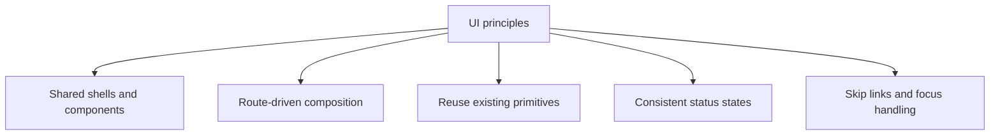
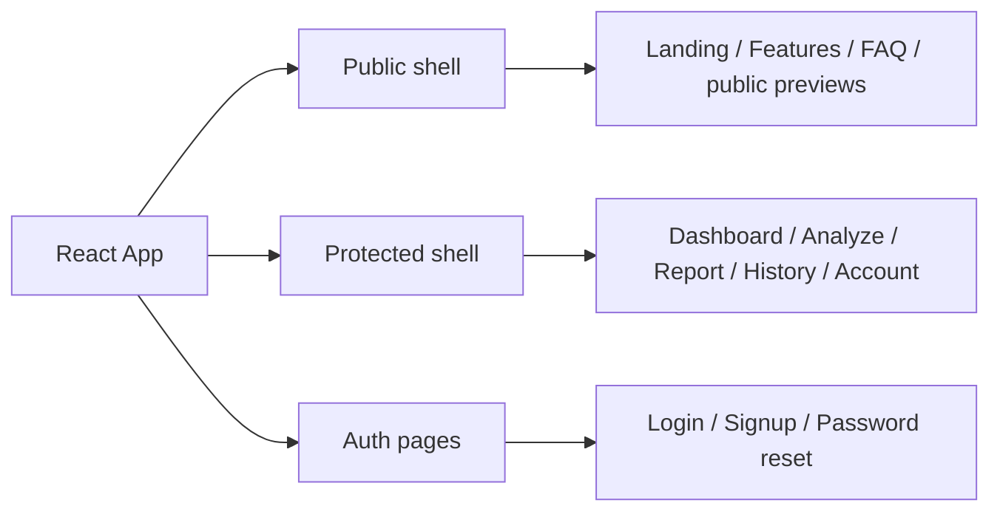

# UI Architecture

## 1. Purpose

This document explains how the Resume Analyzer frontend is organized. It focuses on the structure of the UI, the route shells, the shared component model, and the state layers used by the React application.

## 2. Frontend Overview

The frontend is a React application built with Vite. It uses React Router for page composition, Supabase-backed auth state, shared route shells for public and private views, and a shared Axios client for authenticated API access.

## 3. Application Composition

`App.jsx` composes the top-level UI providers and wrappers in a fixed order:

- `AuthProvider` supplies session and user state.
- `AuthModalProvider` supplies login and signup navigation helpers.
- `ReportProvider` stores the current report id.
- `ApiAuthBridge` activates the Axios auth interceptor and session handling hook.
- `ErrorBoundary` wraps the routed UI.
- `ScrollToTop` runs before route rendering.
- `AppRoutes` renders the route tree.

## 4. Routing Architecture

`AppRoutes.jsx` divides the UI into public pages, public preview routes, public authentication routes, protected application routes, and the fallback 404 route.

## 5. Layout Hierarchy

The UI uses a small number of reusable shells:

- `PublicSite` wraps public marketing pages with shared header, mobile navigation, and footer.
- `PublicAppLayout` wraps public preview app pages with the same width and spacing rhythm used in the private app shell.
- `AppLayout` wraps protected application pages with the shared app header, mobile navigation, outlet rendering, and footer.
- `AuthLayout` wraps authentication pages inside the public site shell and adds the sign-in desk layout.

## 6. Shared Components

Shared UI components are used across multiple pages rather than duplicated inside individual routes.

- `AppHeader`, `MobileNav`, and `AppFooter` provide the global navigation and footer chrome.
- `Sheet`, `StickyNote`, `Eyebrow`, and `PaperClip` define the paper-themed visual language.
- `StatusSheet` and `StatusInline` standardize recovery and validation messaging.
- `ErrorBoundary` handles unexpected render failures at the app shell level.
- `AtsScore` and the chart components are reused across report, dashboard, and history views.

## 7. Context Providers

The frontend uses three React context providers:

- `AuthContext` manages Supabase session state, signed-in user state, and auth actions.
- `AuthModalContext` manages auth navigation and deferred actions after sign-in.
- `ReportContext` stores the current analysis/report id for report navigation and reload behavior.

## 8. State Management

The frontend does not use a separate global state library.

- Page-level interaction state lives in React component state.
- Cross-route state is handled with React context.
- Short-lived workflow data is stored in browser storage where implemented, including auth notices, session timestamps, current report id, draft job description, and latest analysis payloads.
- Cross-tab auth and activity events are synchronized through the session sync service.
- `useApiAuth` connects session state to the Axios client and coordinates pending actions and logout behavior.

## 9. UI Design Principles

The implemented UI follows a small set of consistent design rules:

- Use route-level composition instead of nested ad hoc page layouts.
- Reuse shared primitives and shells across public and private routes.
- Keep recovery states standardized through `StatusSheet` and `StatusInline`.
- Preserve keyboard and screen-reader access with skip links, focus handling, and route-level fallback behavior.
- Keep the visual language consistent through the shared paper-themed primitives.

## 10. Current UI Architecture Summary

Resume Analyzer’s frontend is organized around a small set of shared shells, three context providers, a centralized route tree, and a reusable component system. Public pages, preview pages, authentication pages, and protected app pages all share the same visual language while remaining separated by route and layout boundaries.
