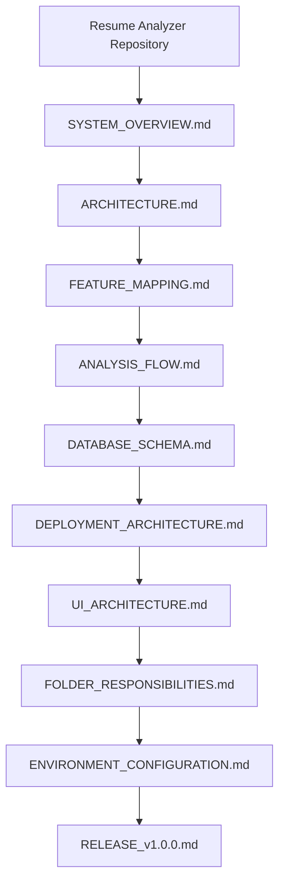
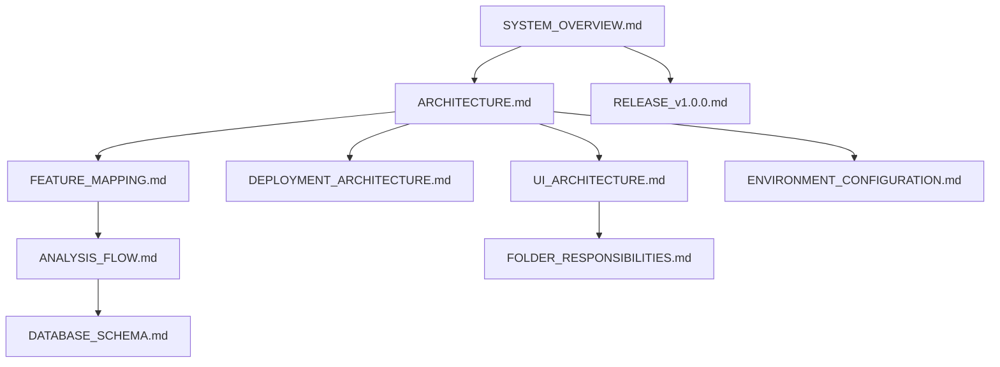

# Engineering Documentation

Welcome to the Resume Analyzer engineering documentation suite. This collection of documents provides comprehensive technical coverage of the application's architecture, data flows, UI patterns, database models, directory boundaries, configuration parameters, and release history. It serves as the primary technical navigation portal for developers, maintainers, and contributors working on the project.

---

## Documentation Roadmap

The recommended reading sequence begins with high-level system comprehension (`SYSTEM_OVERVIEW.md` and `ARCHITECTURE.md`), moves into domain feature mapping and process lifecycle details (`FEATURE_MAPPING.md` and `ANALYSIS_FLOW.md`), progresses through technical schemas and infrastructure (`DATABASE_SCHEMA.md` and `DEPLOYMENT_ARCHITECTURE.md`), and concludes with implementation specifics, environment setup, and release records (`UI_ARCHITECTURE.md`, `FOLDER_RESPONSIBILITIES.md`, `ENVIRONMENT_CONFIGURATION.md`, and `RELEASE_v1.0.0.md`).

---

## Documentation Categories

### Architecture

* **`SYSTEM_OVERVIEW.md`**
  * **Purpose**: Provides a top-level introduction to the product purpose, core capabilities, system components, and overall technical architecture.
  * **Primary Audience**: New contributors, full-stack developers, and project stakeholders.
  * **When to Read**: Read first to gain an initial mental model of the system.
* **`ARCHITECTURE.md`**
  * **Purpose**: Details system-wide architectural patterns, client-server separation, security boundaries, and data flow mechanisms.
  * **Primary Audience**: Senior developers, full-stack engineers, and software architects.
  * **When to Read**: Read when designing new features or modifying cross-cutting system behavior.
* **`UI_ARCHITECTURE.md`**
  * **Purpose**: Outlines frontend design systems, component hierarchies, state management strategies, routing rules, and layout structures.
  * **Primary Audience**: Frontend developers and UI/UX engineers.
  * **When to Read**: Read before implementing new user interfaces or refactoring client components.
* **`DEPLOYMENT_ARCHITECTURE.md`**
  * **Purpose**: Describes deployment targets, environment requirements, static host configs, and runtime backend specifications.
  * **Primary Audience**: DevOps engineers, system administrators, and release maintainers.
  * **When to Read**: Read prior to deploying to staging or production environments.

### Workflows

* **`FEATURE_MAPPING.md`**
  * **Purpose**: Maps user-facing capabilities directly to supporting code paths, routes, controllers, and services.
  * **Primary Audience**: Full-stack developers, feature developers, and code reviewers.
  * **When to Read**: Read when tracing a feature implementation from UI input to database output.
* **`ANALYSIS_FLOW.md`**
  * **Purpose**: Documents the end-to-end lifecycle of a resume analysis from document upload through text extraction, Gemini AI evaluation, persistence, and report rendering.
  * **Primary Audience**: Backend developers and AI integration engineers.
  * **When to Read**: Read before modifying file upload, document parsing, or AI analysis logic.

### Reference

* **`DATABASE_SCHEMA.md`**
  * **Purpose**: Defines MongoDB collection schemas, field specifications, Mongoose indexes, data ownership models, and CRUD operations.
  * **Primary Audience**: Backend developers and database administrators.
  * **When to Read**: Read when querying MongoDB or extending data models.
* **`FOLDER_RESPONSIBILITIES.md`**
  * **Purpose**: Establishes directory ownership, architectural boundaries, and code placement rules across frontend and backend folders.
  * **Primary Audience**: All developers and code reviewers.
  * **When to Read**: Read to determine where new files, services, or components belong in the codebase.
* **`ENVIRONMENT_CONFIGURATION.md`**
  * **Purpose**: Serves as the authoritative reference for client and server environment variables, startup validation logic, and security settings.
  * **Primary Audience**: Developers configuring local environments and release maintainers.
  * **When to Read**: Read during initial environment setup or when adding new environment configurations.

### Release

* **`RELEASE_v1.0.0.md`**
  * **Purpose**: Serves as the official production release record for Version 1.0.0, capturing delivered features, technical improvements, and known limitations.
  * **Primary Audience**: Project maintainers, release managers, and auditors.
  * **When to Read**: Read to verify delivered features and constraints for the v1.0.0 release.

---

## Recommended Reading Paths

### New Contributor
1. `SYSTEM_OVERVIEW.md` (Gain product and high-level technical context)
2. `FOLDER_RESPONSIBILITIES.md` (Learn repository directory layout and code placement rules)
3. `ENVIRONMENT_CONFIGURATION.md` (Set up local environment variables correctly)
4. `FEATURE_MAPPING.md` (Understand how user features map to code files)

### Frontend Developer
1. `SYSTEM_OVERVIEW.md` (Understand high-level product structure)
2. `UI_ARCHITECTURE.md` (Learn design systems, components, routes, and state patterns)
3. `FEATURE_MAPPING.md` (Trace client features to API routes)
4. `ENVIRONMENT_CONFIGURATION.md` (Configure client `VITE_*` environment variables)

### Backend Developer
1. `SYSTEM_OVERVIEW.md` (Understand overall product context)
2. `ARCHITECTURE.md` (Understand client-server architecture and security boundaries)
3. `ANALYSIS_FLOW.md` (Master document extraction, Gemini integration, and file cleanup)
4. `DATABASE_SCHEMA.md` (Review MongoDB collection models and query filters)
5. `ENVIRONMENT_CONFIGURATION.md` (Configure server environment variables)

### Full Stack Developer
1. `SYSTEM_OVERVIEW.md`
2. `ARCHITECTURE.md`
3. `FEATURE_MAPPING.md`
4. `ANALYSIS_FLOW.md`
5. `DATABASE_SCHEMA.md`
6. `UI_ARCHITECTURE.md`
7. `FOLDER_RESPONSIBILITIES.md`

### Project Maintainer
1. `SYSTEM_OVERVIEW.md`
2. `ARCHITECTURE.md`
3. `DEPLOYMENT_ARCHITECTURE.md`
4. `ENVIRONMENT_CONFIGURATION.md`
5. `RELEASE_v1.0.0.md`

---

## Documentation Dependency Map

System Overview acts as the root node. Architecture informs Feature Mapping, Deployment, UI Architecture, and Environment Configuration. Analysis Flow depends on Feature Mapping and feeds directly into Database Schema details.

---

## Documentation Principles

* **Implementation as Source of Truth**: All documentation directly reflects executed codebase behavior without speculation or planned features.
* **Mermaid Diagram Standard**: Every major document begins with a structured GitHub-native Mermaid flowchart or diagram visualizing key relationships.
* **Single Responsibility per Document**: Each file maintains a strict focus on a specific domain (e.g., UI, database, environment, directory structure) to prevent overlap.
* **Zero Duplication**: Technical details live in a single canonical document; other documents reference rather than duplicate content.
* **Evolving Documentation**: Documentation updates are treated as first-class citizens alongside codebase modifications.

---

## Maintenance Guidelines

* **Atomic Pull Requests**: Update corresponding documentation in the exact same pull request where implementation or schema changes occur.
* **Diagram Synchronization**: Whenever routes, workflows, or folder structures change, update the corresponding Mermaid diagrams.
* **Code Review Enforcement**: Verify technical documentation accuracy during peer code reviews before merging changes.
* **Single Source of Truth**: Never duplicate configuration lists or schema tables; link directly to the authoritative reference document.

---

## Related Repository Files

Root repository governance and license files reside outside the `docs/` directory to adhere to GitHub community standards:

* **`README.md`**: Main entry point for the GitHub repository containing setup commands, quickstart guides, and project overview.
* **`CHANGELOG.md`**: Project version history following the Keep a Changelog specification.
* **`CONTRIBUTING.md`**: Contribution guidelines, code style conventions, and git workflow practices.
* **`SECURITY.md`**: Security vulnerability reporting procedures and supported version policy.
* **`LICENSE`**: MIT open-source software license.

---

## Summary

The Resume Analyzer documentation suite provides complete technical coverage across all architectural layers. By following the reading roadmap and category breakdowns in this homepage, developers can efficiently navigate between high-level system concepts, workflow specifications, database schemas, and directory responsibility boundaries.
