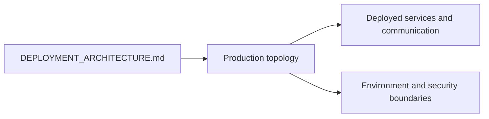
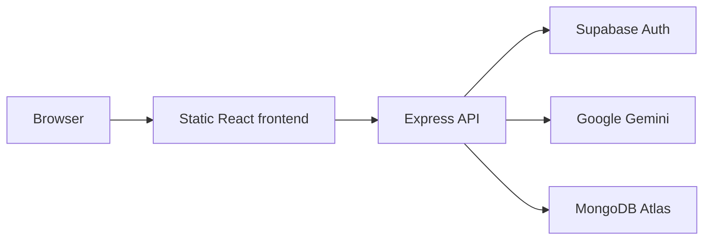
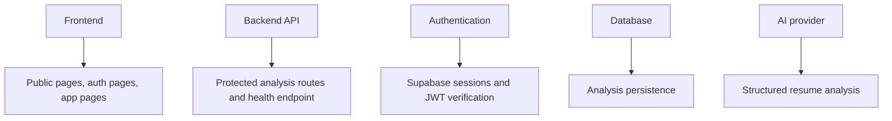
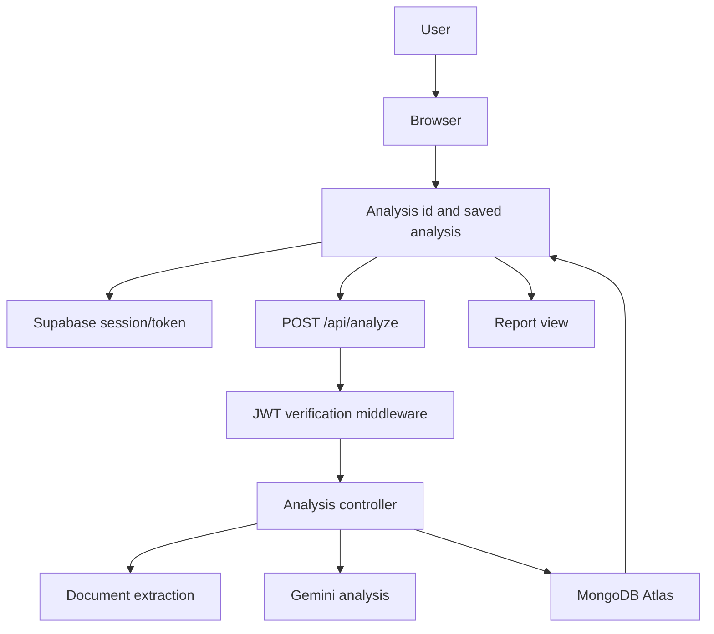
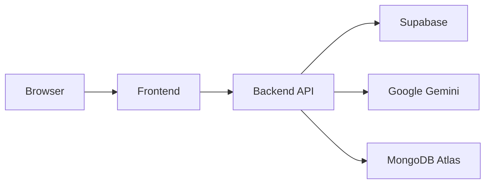
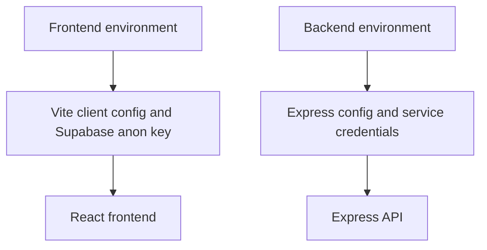
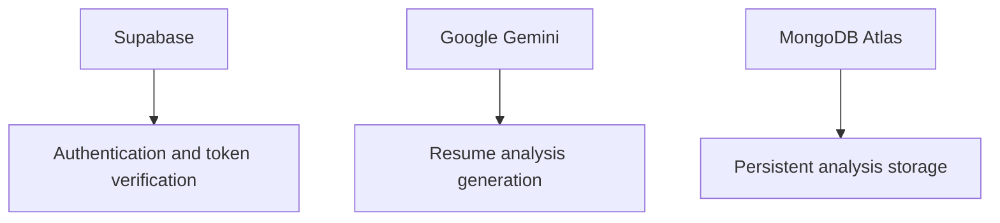
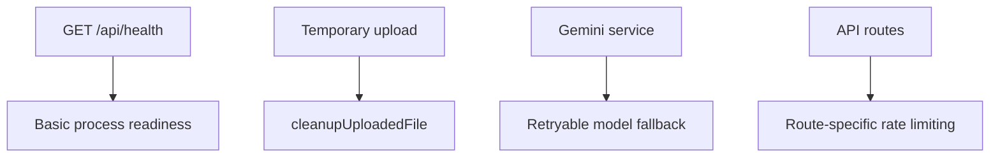
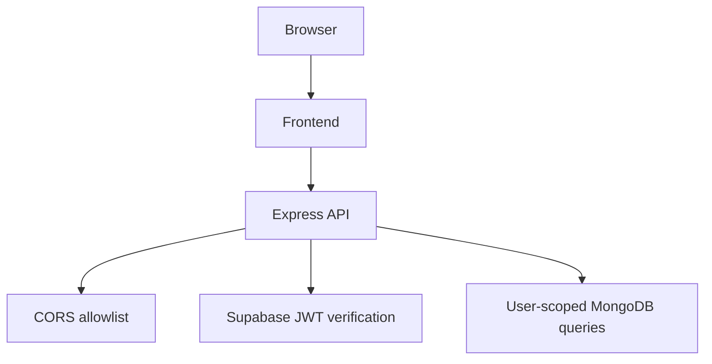

# Deployment Architecture

## Navigation

[Documentation Home](../README.md) | [Previous Document](DATABASE_SCHEMA.md) | [Next Document](UI_ARCHITECTURE.md)

---

## 1. Purpose

This document describes the production deployment topology used by Resume Analyzer and how the deployed services communicate. It does not provide deployment instructions.

## 2. Deployment Overview

Resume Analyzer is deployed as two application surfaces plus external production services:

- A React frontend built with Vite and served as static assets.
- An Express API that handles authentication-gated analysis requests.
- Supabase for authentication.
- Google Gemini for analysis generation.
- MongoDB Atlas for persisted analysis records.

The repository does not include Vercel, Render, Docker, or similar deployment manifests.

## 3. Production Components

**Frontend**

- Renders the public site and the authenticated application.
- Sends API requests through the shared Axios client.
- Manages Supabase session state, route access, and report navigation.

**Backend API**

- Receives the analysis upload request.
- Verifies Supabase access tokens.
- Handles upload validation, text extraction, Gemini analysis, persistence, reads, and deletes.
- Exposes the `/api/health` endpoint.

**Authentication**

- Supabase provides sign up, sign in, password reset, and session verification.
- The frontend stores and refreshes the user session.
- The backend validates bearer tokens on protected routes.

**Database**

- MongoDB Atlas stores completed analysis records.
- The backend persists one analysis document per successful request.

**AI Provider**

- Google Gemini generates the structured analysis payload from extracted resume text and the job description.

## 4. Request Flow

The production analysis request is initiated in the browser, authenticated by the API, processed on the backend, persisted in MongoDB, and then displayed in the report view.

## 5. Service Communication

- **Browser to Frontend:** The browser loads the static frontend bundle and interacts with the React application.
- **Frontend to Backend:** The frontend sends authenticated requests to the Express API through the configured API base URL.
- **Backend to Supabase:** The backend verifies bearer tokens using Supabase authentication services.
- **Backend to Gemini:** The backend sends extracted resume text and the job description to Gemini for analysis.
- **Backend to MongoDB:** The backend stores and retrieves analysis records from MongoDB Atlas.

## 6. Environment Boundaries

Frontend and backend configuration are separated by runtime boundary:

- The frontend reads its own Vite environment values at build and browser runtime.
- The backend reads server environment values at process startup.
- The frontend uses the public Supabase anon key and backend API URL.
- The backend uses the MongoDB URI, Supabase service role credentials, Gemini API key, and production CORS allowlist.
- The repository does not define a shared deployment manifest; configuration is supplied separately for each runtime.

## 7. External Dependencies

**Supabase**

- Purpose: authentication and session verification.
- Interaction: the frontend creates sessions; the backend verifies access tokens and fetches the current user.
- Failure impact: sign in, sign up, password reset, and all protected API requests fail.

**Google Gemini**

- Purpose: generate structured analysis from the extracted resume text and job description.
- Interaction: the backend calls Gemini from the analysis controller through the Gemini service.
- Failure impact: analysis requests fail or return a Gemini-specific error state.

**MongoDB Atlas**

- Purpose: store completed analysis records.
- Interaction: the backend creates, reads, and deletes analysis documents.
- Failure impact: dashboard, history, and report retrieval fail, and new analyses cannot be persisted.

## 8. Reliability Considerations

- The API exposes `/api/health` and returns a simple JSON readiness response.
- Temporary uploaded files are deleted after analysis success or failure paths.
- The Gemini service retries retryable failures and falls back across the configured model chain.
- The API applies route-specific rate limiting and a general API limiter.
- The server validates environment variables at startup and exits when required values are missing.

## 9. Security Boundaries

- Authentication is based on Supabase bearer tokens.
- The backend verifies JWT-backed access before protected analysis and archive routes run.
- CORS is restricted by the configured frontend origin allowlist.
- The backend treats the API as the trust boundary for protected data access.
- MongoDB queries are filtered by authenticated user id so records remain user-scoped.
- The backend uses Helmet and no-cache headers on authenticated API responses.

## 10. Current Deployment Summary

Resume Analyzer is deployed as a statically served React frontend backed by an Express API. The API is the production trust boundary for authentication, analysis processing, and persistence, while Supabase, Gemini, and MongoDB Atlas provide the external services required for the application to operate.

---

## Related Documentation

- [System Overview](SYSTEM_OVERVIEW.md)
- [Architecture](ARCHITECTURE.md)
- [Environment Configuration](../reference/ENVIRONMENT_CONFIGURATION.md)

