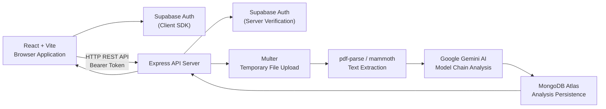

# Release v1.0.0

## Navigation

[Documentation Home](../README.md) | [Previous Document](ENVIRONMENT_CONFIGURATION.md) | [Next Document](../README.md)

---

## 1. Release Overview

| Field        | Value                           |
| ------------ | ------------------------------- |
| Version      | 1.0.0                          |
| Release Date | 2026-07-18                     |
| Release Type | Initial Production Release     |
| Status       | Released                       |
| License      | MIT                            |

---

## 2. Release Highlights

Resume Analyzer v1.0.0 delivers a complete resume-to-job-description analysis application. The release includes:

- A public marketing website with landing, features, and FAQ pages.
- Supabase-based authentication with sign up, sign in, password reset, session sync, and protected route access.
- A full resume analysis pipeline: PDF/DOCX upload, server-side text extraction, Google Gemini AI analysis with structured JSON output, and MongoDB persistence.
- An authenticated application experience with dashboard, analysis submission, report viewing, analysis history with search and delete, and account management.
- Public preview routes that expose read-only or demo states of the analysis, report, and history views without requiring sign-in.
- Endpoint-specific rate limiting, file signature validation, startup environment validation, Helmet security headers, and CORS origin enforcement.
- Engineering documentation covering system overview, architecture, feature mapping, analysis flow, database schema, deployment architecture, UI architecture, folder responsibilities, and environment configuration.

---

## 3. Features Delivered

### Public Website

- **Landing Page** (`/`, `/landing-v2`): Product introduction with cinematic hero, feature preview sections, review process walkthrough, and navigation into the application.
- **Features Page** (`/features`): Structured feature grid with hover-driven demo states and call-to-action into the analysis flow.
- **FAQ Page** (`/faq`): Searchable and filterable FAQ chapters with expandable answers covering analysis, files, privacy, and usage.
- **Not Found Page** (`*`): Fallback 404 page with navigation back to the home page.
- **Public Preview Routes** (`/analyze`, `/report`, `/history`): Preview versions of the analysis, report, and history screens rendered without authentication using demo data, localStorage fallback, or empty archive states.

### Authentication

- **Sign Up** (`/signup`): Account creation via Supabase with password validation and user metadata.
- **Sign In** (`/login`): Email/password authentication with redirect-back support and pending action replay.
- **Password Reset Request** (`/forgot-password`): Sends a Supabase password reset email.
- **Password Reset Completion** (`/reset-password`): Completes password update after recovery session is established.
- **Sign Out**: Local session termination from the app footer, user menu, and account page, including automatic sign-out on 401 API responses.
- **Session Management**: Session expiry handling, inactivity detection, cross-tab session synchronization, and AuthGate-protected routes.

### Resume Analysis

- **Analysis Submission** (`/app/analyze`): Upload a PDF or DOCX resume and enter a job description. Client-side file and text validation, guest sign-in gating, abort controller support, and staged reading progress UI.
- **Server-Side Processing**: Multer file upload to temporary storage, magic-bytes file signature validation, text extraction via `pdf-parse` (PDF) and `mammoth` (DOCX), Gemini prompt construction and model chain fallback (`gemini-2.5-flash` → `gemini-2.0-flash` → `gemini-1.5-flash`), structured JSON response parsing, and MongoDB persistence.
- **Temporary File Cleanup**: Uploaded files are deleted after processing on both success and failure paths.

### Dashboard

- **Dashboard** (`/app/dashboard`): Private landing page showing archive summary counts, recent analysis activity, a continue-working panel reading from localStorage, and quick-action shortcuts into analysis and history.

### History

- **Analysis History** (`/app/history`): Paginated and searchable archive listing of saved analyses. Supports opening a report, deleting an analysis with confirmation dialog, and rendering loading, empty, filtered-empty, and error states.

### Reports

- **Report View** (`/app/report`): Displays a saved analysis as a report with match percentage, matched and missing skills, score breakdown charts (via Recharts), improvement suggestions with clipboard copy, and highlighted job description text. Falls back to localStorage or a demo report when no report ID or session is available.

### Account

- **Account Page** (`/app/account`): Shows user profile details, sign-in provider, session timestamps, and provides password reset and sign-out actions.

### API Endpoints

| Method   | Path                  | Purpose                            |
| -------- | --------------------- | ---------------------------------- |
| `POST`   | `/api/analyze`        | Submit resume and job description  |
| `GET`    | `/api/analyses`       | List analyses for authenticated user |
| `GET`    | `/api/analyses/:id`   | Retrieve a single analysis         |
| `DELETE` | `/api/analyses/:id`   | Delete a single analysis           |
| `GET`    | `/api/health`         | Backend health check               |

---

## 4. Architecture Summary

- **Frontend**: React 18 single-page application built with Vite 8. Uses React Router for client-side routing, Axios for API communication, Framer Motion for animations, and Recharts for score charts. Supabase JS SDK handles client-side authentication and session management.
- **Backend**: Express 4 REST API server running on Node.js. Validates requests through authentication middleware, rate limiters, upload handling, and request validation middleware. Coordinates document extraction, Gemini analysis, and MongoDB persistence through a controller layer.
- **Supabase**: Provides user authentication on both client and server. The client SDK manages sessions using the anonymous key. The server verifies JWT tokens using the service role key via `supabase.auth.getUser()`.
- **Google Gemini**: Provides structured resume analysis via the `@google/generative-ai` SDK. The backend implements a three-model fallback chain with per-model retry logic and exponential backoff.
- **MongoDB**: Stores analysis records using Mongoose with a compound index on `{ userId, createdAt }` and a single-field index on `{ createdAt }`. All queries are scoped to the authenticated user.

---

## 5. Technical Improvements

### Startup Environment Validation

- Client and server both validate required environment variables at startup before initializing application logic.
- The client throws a rendering error if `VITE_API_URL`, `VITE_SUPABASE_URL`, or `VITE_SUPABASE_ANON_KEY` are missing.
- The server terminates with `process.exit(1)` if `MONGODB_URI`, `GEMINI_API_KEY`, `JWT_SECRET`, `SUPABASE_URL`, or `SUPABASE_SERVICE_ROLE_KEY` are missing.
- `ALLOWED_ORIGINS` is enforced as required in production mode.

### Security

- Supabase JWT Bearer token verification on all protected API routes.
- Helmet HTTP security headers applied to all responses.
- CORS origin allowlisting with production-mode enforcement.
- Upload file type restricted to PDF and DOCX by MIME type, file extension, and magic-byte signature validation.
- 5 MB file size limit and single-file-per-request enforcement.
- Filename sanitization to prevent path traversal.
- API response caching disabled on authenticated endpoints (`Cache-Control: no-store`).
- Server secrets (`MONGODB_URI`, `GEMINI_API_KEY`, `SUPABASE_SERVICE_ROLE_KEY`, `JWT_SECRET`) isolated from the browser environment.

### Rate Limiting

- Endpoint-specific rate limiters: auth (5/15min), signup (5/60min), analysis (15/60min), dashboard/history/report (300/15min), and general API (300/15min).
- Rate limiters key by authenticated user ID or client IP.
- Development and test environments bypass rate limits.

### Failure Handling

- Gemini errors are classified by error code into retryable and non-retryable categories with structured user-facing messages.
- Extraction errors are classified by error code with specific user-facing messages for timeout, password-protected, corrupted, empty, and oversized documents.
- Three-model Gemini fallback chain with per-model exponential backoff retries.
- Frontend error mapping translates API error responses into contextual StatusSheet and StatusInline components with retry actions.
- ErrorBoundary catches unexpected React render failures with reload and return-home recovery options.
- Guaranteed temporary file cleanup in the controller `finally` block and validation middleware.

### Validation and Limits

- Resume uploads limited to PDF and DOCX files, 5 MB maximum, one file per request.
- Job descriptions limited to 10,000 characters with whitespace trimming.
- PDF extraction limited to 50 pages with a 30-second timeout.
- Extracted resume text capped at 500,000 characters before Gemini analysis.
- MongoDB ObjectId validation before database queries.

### Session Management

- Cross-tab session synchronization via `sessionSync` service.
- Session expiry handling with inactivity detection.
- Automatic sign-out on 401 API responses with redirect to login.
- Axios request interceptor attaches Bearer token from the active Supabase session.

---

## 6. Documentation Delivered

| Document                       | Purpose                                                          |
| ------------------------------ | ---------------------------------------------------------------- |
| `README.md`                    | Project overview, routes, features, setup, and deployment        |
| `CHANGELOG.md`                 | Version history following Keep a Changelog format                |
| `CONTRIBUTING.md`              | Contribution guidelines, branching, and coding standards         |
| `SECURITY.md`                  | Security policy, supported versions, and vulnerability reporting |
| `LICENSE`                      | MIT license terms                                                |
| `SYSTEM_OVERVIEW.md`           | Product purpose, capabilities, workflow, and technology stack    |
| `ARCHITECTURE.md`              | System architecture, component interaction, and data flow        |
| `UI_ARCHITECTURE.md`           | Frontend component hierarchy, layouts, and design system         |
| `FEATURE_MAPPING.md`           | Feature-to-code-path mapping for all implemented features        |
| `ANALYSIS_FLOW.md`             | End-to-end analysis lifecycle from submission to report display  |
| `DATABASE_SCHEMA.md`           | MongoDB schema, indexes, CRUD operations, and data lifecycle     |
| `DEPLOYMENT_ARCHITECTURE.md`   | Deployment targets, environment, and infrastructure requirements |
| `FOLDER_RESPONSIBILITIES.md`   | Directory ownership and architectural boundaries                 |
| `ENVIRONMENT_CONFIGURATION.md` | Environment variables, validation, and external service bindings |

Reference screenshots included in `docs/screenshots/`: Home, Review, Report, Archive, and Account.

---

## 7. Known Limitations

- **No automated test suite**: The repository does not include unit, integration, or end-to-end tests.
- **No CI/CD pipeline**: No GitHub Actions workflows or deployment automation are implemented.
- **No database update operations**: Analysis records cannot be edited after creation; only create, read, and delete are supported.
- **Client-side search and pagination only**: The history page fetches all analyses from the API and filters/paginates entirely in the browser.
- **Single collection schema**: Only the `Analysis` collection exists; there is no separate `User` collection in MongoDB. User identity relies entirely on Supabase.
- **No public live demo URL**: No hosted deployment URL is published in the repository.
- **No deployment manifests**: The repository does not include Docker, Kubernetes, or platform-specific deployment configurations.
- **Temporary upload storage**: Uploaded files are stored on the local filesystem (`server/uploads/`) and cleaned up after processing; no external object storage is used.

---

## 8. Repository Snapshot

| Category          | Implementation                                                                  |
| ----------------- | ------------------------------------------------------------------------------- |
| Frontend          | React 18, Vite 8, React Router 6, Axios, Framer Motion, Recharts, Tailwind CSS 4 |
| Backend           | Node.js, Express 4, Mongoose 7, Multer, Helmet 7, CORS, express-rate-limit 7   |
| Document Parsing  | `pdf-parse` (PDF), `mammoth` (DOCX)                                            |
| Authentication    | Supabase Auth (`@supabase/supabase-js` v2) — client and server                 |
| AI Provider       | Google Gemini via `@google/generative-ai` v0.24 — three-model fallback chain   |
| Database          | MongoDB Atlas via Mongoose — single `Analysis` collection                       |
| Deployment Target | Static host for frontend (`client/dist`), Node.js host for backend              |
| License           | MIT                                                                             |

---

## 9. Release Summary

Resume Analyzer v1.0.0 delivers a production-ready, full-stack resume analysis application. The frontend provides a public marketing website, Supabase-authenticated user sessions, and a protected application experience with dashboard, analysis, report, history, and account views. The backend accepts PDF and DOCX uploads, validates file integrity at the byte level, extracts document text, orchestrates structured Gemini AI analysis with model fallback, and persists results in MongoDB with per-user ownership. The release includes startup environment validation, endpoint-specific rate limiting, comprehensive error classification and recovery UI, cross-tab session synchronization, and fourteen engineering documentation files covering system architecture, feature mapping, data flow, deployment, and configuration.

---

## Related Documents

- [Documentation Home](../README.md)
- [Environment Configuration](ENVIRONMENT_CONFIGURATION.md)
- [Changelog](../../CHANGELOG.md)
